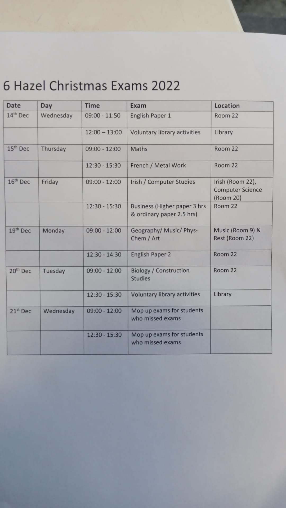
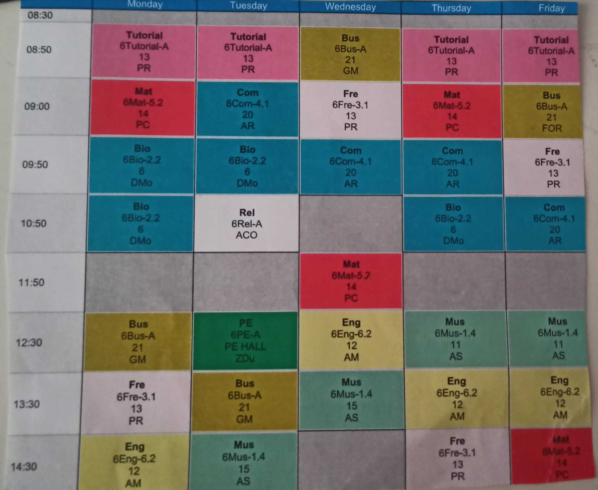

# Notes, Anki Decks and Resources
- Biology: [Notes](subjects/biology/biology.md) - [Anki Deck](anki/biology.apkg)
- Business: [Notes](subjects/business/business.md) - [Anki Deck](anki/business.apkg)
- Computer Science: [Notes](subjects/computer-science/computer-science.md)
- English: [Notes](subjects/english/english.md)
- French (Français): [Notes](subjects/french/french.md) - [Anki Deck](anki/french.apkg)
- Maths: [Notes](subjects/maths/maths.md)
- Music: [Notes](subjects/music/music.md) - [Anki Deck](anki/music.apkg)
<!-- [Study Methods & Tips](study.md)-->

---

- [Chemistry](other-subjects/chemistry.md)
- [Geography](other-subjects/geography.md)
- [History](other-subjects/history.md)
- [Irish (Gaeilge)](other-subjects/irish.md)
- [Japanese](other-subjects/japanese.md)
- [Physics](other-subjects/physics.md)
- [Phys-Chem](other-subjects/phys-chem/phys-chem.md)

# Christmas Exams Info
- [Biology](christmas/biology.md)
- [Business](christmas/business.md)
- [Computer Science](christmas/computer-science.md)
- [English](christmas/english.md)
- [French](christmas/french.md)
- [Maths](christmas/maths.md)
- [Music](christmas/music.md)

# Christmas Exams 2022 Timetable

| Date | Time | Exam | Location |
|-|-|-|-|
| 14/12/2022 (Wednesday) | 09:00 - 11:50 | English Paper 1 | Room 22 |
| 15/12/2022 (Thursday) | 09:00 - 12:00 | Maths | Room 22 |
| 15/12/2022 (Thursday) | 12:30 - 15:30 | French / Metal Work | Room 22 |
| 16/12/2022 (Friday) | 09:00 - 12:00 | Irish / Computer Science | Irish (Room 22) & Computer Science (Room 20) |
| 16/12/2022 (Friday) | 12:30 - 15:30 | Business (3 Hours for Higher Level, 2 Hours 30 Minutes for Ordinary Level) | Room 22 |
| 19/12/2022 (Monday) | 09:00 - 12:00 | Geography / Music / Phys-Chem / Art | Music (Room 9) & Rest (Room 22)
| 19/12/2022 (Monday) | 12:30 - 14:30 | English Paper 2 | Room 22 |
| 20/12/2022 (Tuesday) | 09:00 - 12:00 | Biology / Construction Studies | Room 22 |
| 21/12/2022 (Wednesday) | 09:00 - 12:00 & 12:30 - 15:30 | Mop up exams for students who missed exams | |
 

# Homework

| Subject | What to Do | Due | Done? |
|-|-|-|-|
| Biology | Finish Photosynthesis Experiment Write-Up | Tuesday, 06/12/2022 | No |

# Timetable

| Time  | Monday                 | Tuesday                       | Wednesday                     | Thursday                      | Friday                            |
|-------|------------------------|-------------------------------|-------------------------------|-------------------------------|-----------------------------------|
| 8:50  | Tutorial               | Tutorial                      | Business                      | Tutorial                      | Tutorial                          |
| 9:00  | Maths                  | Computer Science/Irish        | French/Engineering            | Maths                         | Relationship and Sexual Education |
| 9:50  | Woodwork/Biology (1/2) | Woodwork/Biology              | Computer Science/Irish        | Computer Science/Irish        | French/Engineering                |
| 10:50 | Woodwork/Biology (2/2) | Career Guidance               | Break                         | Woodwork/Biology              | Computer Science/Irish            |
| 11:50 | Break                  | Break                         | Maths                         | Break                         | Break                             |
| 12:30 | Business               | PE                            | English                       | Music/Phys-Chem/Art/Geography | Music/Phys-Chem/Art/Geography     |
| 13:30 | French/Engineering     | Business                      | Music/Phys-Chem/Art/Geography | English                       | English                           |
| 14:30 | English                | Music/Phys-Chem/Art/Geography |                               | French/Engineering            | Maths                             |

# Calendar

| Event | Information | Date | Time |
|-|-|-|-|
| Music Musescore Test | | 06/12/2022 | |
| French Oral Christmas Exam | From Paul | 07/12/2022 | 09:00 |
| Half Day | From Paul | Friday, 08/12/2022 | |
| French Listening Christmas Exam | | Friday, 09/12/2022 | 09:50 |
| Ice Skating | | Friday, 09/12/2022 | |
| Christmas Exams Start | This date is subject to change | 12/12/2022 | |
| Mock Exams Begin | From Paul, Mock to take place 10 days before SEC oral | 07/02/2023 | |
| LC French Oral Week Begins | From Paul, LC Oral with take place week beginning: 01/04/2023 | 01/04/2023 | |
| State Exams Commence | From Paul | 07/06/2023 | |
| French State Exam Typical Date | From Paul | 14/06/2023 or 16/06/2023 | |
| Debs | Doing it with a school called Warrenpoint. It will take place in the Red Cow. Ticket Price will be €80 to €100. All details are subject to change | 23/08/2023 | |

# Resources
- [Line Graph Maker](https://www.rapidtables.com/tools/line-graph.html)
- [Studyclix](https://studyclix.ie/) - Website with Notes, Previous Exam Questions, Quizzes, Past Papers and Marking Schemes
- [Leaving Cert Help Notes](https://leaving-cert-helpnotes.blogspot.com/2014/10/links-to-all-my-posts-by-subject.html) - Website with Notes
- [StudyJams](https://studyjams.scholastic.com/) - Website with Notes
- [Sparknotes](https://www.sparknotes.com/) - Website with Notes
- [Studynotes.ie](https://studynotes.ie/feed/leaving-certificate) - Website with Notes
- [625points](https://www.625points.com/) - Website with Notes, Tips and Exam Predictions
- [Scoilnet](https://www.scoilnet.ie/) - Website with Notes
- [Examinations.ie](https://www.examinations.ie/) - Official Website with Past Exam Papers and Marking Schemes
- [Quizizz](https://quizizz.com/) - Website with Quizzes
- [MyCJFallon](https://my.cjfallon.ie/dashboard/student-resources) - Website with CJFallon Ebooks
- [AbpiSchools](https://www.abpischools.org.uk/) - Website with Notes and Worksheets
- [Learning Apps](https://learningapps.org/) - Website with Notes and Other Materials
- [TheLeavingCert.com](https://www.theleavingcert.com/) - Leaving Cert Papers, News, Notes, Tips and Resources
- [Curriculum Online](https://www.curriculumonline.ie) - Find Info about Every Leaving Cert Subject
- [Edco Online Learning Hub](https://edco.ie/onlinestudyhub) - Website with study tips and links to "Useful Websites"

## Language Resources (Irish, French, German, Spanish, Japanese Etc.)
- [Duolingo](https://www.duolingo.com/) - A gamified approach to learning a language (App and Website)
- [Drops](https://languagedrops.com/) - Learn Vocabulary of a langauge (App and Website)
- [Scripts](https://languagedrops.com/scripts) - Learn to write in different Writing Systems (App & Website) (Good for Japanese, Mandarin and Russian)
- [Clozemaster](https://www.clozemaster.com/) - Learn Language in Context (App and Website)
- [Ling Learn](https://ling-app.com/) - Learn a Language (App and Website)
- [MetaLanguage](https://play.google.com/store/apps/collection/cluster?clp=igM4ChkKEzgwNDgwMjQ4Mjc4OTc0OTY0MzUQCBgDEhkKEzgwNDgwMjQ4Mjc4OTc0OTY0MzUQCBgDGAA%3D:S:ANO1ljIqyhA&gsr=CjuKAzgKGQoTODA0ODAyNDgyNzg5NzQ5NjQzNRAIGAMSGQoTODA0ODAyNDgyNzg5NzQ5NjQzNRAIGAMYAA%3D%3D:S:ANO1ljKKjXw&hl=en_US&gl=US) - Company that makes Android apps to help learn a language
- Jernung: [Android](https://play.google.com/store/apps/dev?id=7157988227995618199&hl=en_US&gl=US), [Apple](https://apps.apple.com/us/developer/jernung/id1268225656#see-all/i-phonei-pad-apps) - Company that makes games to help learn and write in a language
- [Mango Languages](https://mangolanguages.com/) - Website and App to Learn Languages
- [Toucan](https://jointoucan.com/) - Browser Extenion that helps build vocabulary by replacing words on websites with words in your target language
