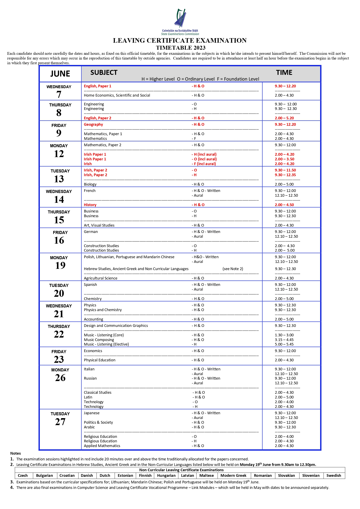

# Notes, Anki Decks and Resources
- Biology: [Notes](subjects/biology/biology.md) - [Anki Deck](anki/biology.apkg) - [Previous Exam Papers](subjects/biology/exam-papers.md)
- Business: [Notes](subjects/business/business.md) - [Anki Deck](anki/business.apkg) - [Previous Exam Papers](subjects/business/exam-papers.md)
- Computer Science: [Notes](subjects/computer-science/computer-science.md) - [Previous Exam Papers](subjects/computer-science/exam-papers.md)
- English: [Notes](subjects/english/english.md) - [Previous Exam Papers](subjects/english/exam-papers.md)
- French (Français): [Notes](subjects/french/french.md) - [Anki Deck](anki/french.apkg) - [Previous Exam Papers](subjects/french/exam-papers.md)
- Maths: [Notes](subjects/maths/maths.md) - [Previous Exam Papers](subjects/maths/exam-papers.md)
- Music: [Notes](subjects/music/music.md) - [Anki Deck](anki/music.apkg) - [Previous Exam Papers](subjects/music/exam-papers.md)

---

- [Chemistry](other-subjects/chemistry.md)
- [Geography](other-subjects/geography.md)
- [History](other-subjects/history.md)
- [Irish (Gaeilge)](other-subjects/irish.md)
- [Japanese](other-subjects/japanese.md)
- [Physics](other-subjects/physics.md)
- [Phys-Chem](other-subjects/phys-chem/phys-chem.md)

# Exam Dates (Only Subjects I Do)

| Date | Subject | Info | Time |
|-|-|-|-|
| Thursday, 08/06/2023 | English | Paper 2 State Exam | 14:00 - 17:20 |
| Friday, 09/06/2023 | Maths | Paper 1 State Exam | 14:00 - 16:30 |
| Monday, 12/06/2023 | Maths | Paper 2 State Exam | 09:00 - 12:00 |
| Tuesday, 13/06/2023 | Biology | State Exam | 14:00 - 17:00 |
| Wednesday, 14/06/2023 | French | State Exam | Written: 09:30 - 12:00, Listening: 12:10 - 12:50 |
| Thursday, 15/06/2023 | Business | State Exam | 09:30 - 12:30 |
| Thursday, 22/06/2023 | Music | State Exam | Listening: 13:30 - 15:00, Composing: 15:15 - 16:45 |

# Calendar

| Event | Information | Date | Time |
|-|-|-|-|
| Debs | Cancelled (from my knowledge), OLD INFO: Doing it with a school called Warrenpoint. It will take place in the Red Cow. Ticket Price will be €80 to €100. All details are subject to change | Wednesday, 23/08/2023 | |

# Resources (For All Subjects)
- [Line Graph Maker](https://www.rapidtables.com/tools/line-graph.html)
- [Studyclix](https://studyclix.ie/) - Website with Notes, Previous Exam Questions, Quizzes, Past Papers and Marking Schemes
- [Leaving Cert Help Notes](https://leaving-cert-helpnotes.blogspot.com/2014/10/links-to-all-my-posts-by-subject.html) - Website with Notes
- [StudyJams](https://studyjams.scholastic.com/) - Website with Notes
- [Sparknotes](https://www.sparknotes.com/) - Website with Notes
- [Studynotes.ie](https://studynotes.ie/feed/leaving-certificate) - Website with Notes
- [625points](https://www.625points.com/) - Website with Notes, Tips and Exam Predictions
- [Scoilnet](https://www.scoilnet.ie/) - Website with Notes
- [Examinations.ie](https://www.examinations.ie/) - Official Website with Past Exam Papers and Marking Schemes
- [Quizizz](https://quizizz.com/) - Website with Quizzes
- [MyCJFallon](https://my.cjfallon.ie/dashboard/student-resources) - Website with CJFallon Ebooks
- [AbpiSchools](https://www.abpischools.org.uk/) - Website with Notes and Worksheets
- [Learning Apps](https://learningapps.org/) - Website with Notes and Other Materials
- [TheLeavingCert.com](https://www.theleavingcert.com/) - Leaving Cert Papers, News, Notes, Tips and Resources
- [Curriculum Online](https://www.curriculumonline.ie) - Find Info about Every Leaving Cert Subject
- [Edco Online Learning Hub](https://edco.ie/onlinestudyhub) - Website with study tips and links to "Useful Websites"

## Language Resources (Irish, French, German, Spanish, Japanese Etc.)
- [Duolingo](https://www.duolingo.com/) - A gamified approach to learning a language (App and Website)
- [Drops](https://languagedrops.com/) - Learn Vocabulary of a language (App and Website)
- [Scripts](https://languagedrops.com/scripts) - Learn to write in different Writing Systems (App & Website) (Good for Japanese, Mandarin and Russian)
- [Clozemaster](https://www.clozemaster.com/) - Learn Language in Context (App and Website)
- [Ling Learn](https://ling-app.com/) - Learn a Language (App and Website)
- [MetaLanguage](https://play.google.com/store/apps/collection/cluster?clp=igM4ChkKEzgwNDgwMjQ4Mjc4OTc0OTY0MzUQCBgDEhkKEzgwNDgwMjQ4Mjc4OTc0OTY0MzUQCBgDGAA%3D:S:ANO1ljIqyhA&gsr=CjuKAzgKGQoTODA0ODAyNDgyNzg5NzQ5NjQzNRAIGAMSGQoTODA0ODAyNDgyNzg5NzQ5NjQzNRAIGAMYAA%3D%3D:S:ANO1ljKKjXw&hl=en_US&gl=US) - Company that makes Android apps to help learn a language
- Jernung: [Android](https://play.google.com/store/apps/dev?id=7157988227995618199&hl=en_US&gl=US), [Apple](https://apps.apple.com/us/developer/jernung/id1268225656#see-all/i-phonei-pad-apps) - Company that makes games to help learn and write in a language
- [Mango Languages](https://mangolanguages.com/) - Website and App to Learn Languages
- [Toucan](https://jointoucan.com/) - Browser Extension that helps build vocabulary by replacing words on websites with words in your target language
