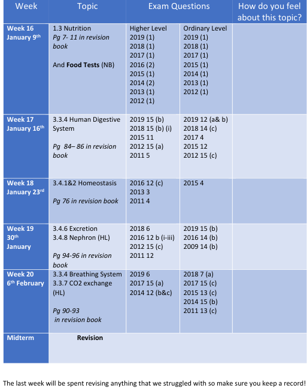

# Biology

The Study of Living Organisms
- [Syllabus & Exam Structure](syllabus-and-exam-structure.md)
- [Study and Exam Tips (From Teachers)](tips.md)
- [Definitions List](terms-and-definitions/biology-definitions.pdf)
  - [‘MUST KNOW’ Biology Terms](terms-and-definitions/need-to-know-definitions.pdf)
## Unit 1 - The Study of Life - [Video Playlist](https://youtube.com/playlist?list=PLgPhtu6xzA1cwFwOLbYpxJTaJbUdZiC8O)
- [(A Search for a) Definition of Life & Characteristics of Life](unit-1/a-search-for-a-definition-of-life.md) (In Anki) - [Slides](slides/unit-1/characteristics-of-life.pdf) - [Terms & Definitions](terms-and-definitions/unit-1/characteristics-of-life.md)
- [Scientific Method](unit-1/scientific-method.md) (In Anki) - [Slides](slides/unit-1/scientific-method.pdf) - [Terms & Definitions](terms-and-definitions/unit-1/scientific-method.md)
- [Nutrition (& Food)](unit-1/nutrition.md) - [Slides](slides/unit-1/nutrition.pdf) - [Terms & Definitions](terms-and-definitions/unit-1/nutrition.md) - [Crossword](other/nutrition-crossword.pdf)
### Ecology - [Terms & Definitions](terms-and-definitions/unit-1/ecology.md)
- [Ecology, Ecosystem, Biosphere, Habitat & Niche](unit-1/ecology-ecosystem-biosphere-habitiat-and-niche.md) - [Slides](slides/unit-1/ecology-ecosystem-biosphere-habitat-&-niche.pdf)
- [Environmental Factors](unit-1/environmental-factors.md) - [Slides](slides/unit-1/environmental-factors.pdf)
- [Nutrient Recycling](unit-1/nutrient-recycling.md) - [Slides](slides/unit-1/nutrient-recycling.pdf)
- [Pyramid of Numbers](unit-1/pyramid-of-numbers.md) - [Slides](slides/unit-1/pyramid-of-numbers.pdf)

## Unit 2 - The Cell - [Video Playlist](https://youtube.com/playlist?list=PLgPhtu6xzA1dnBCtGOPCN-ak7TARs-wu1)
- [The Cell](unit-2/the-cell.md) - [Slides](slides/unit-2/the-cell.pdf) - [Terms & Definitions](terms-and-definitions/unit-2/the-cell.md)
- [Respiration](unit-2/respiration.md) - [Slides](slides/unit-2/respiration.pdf)
- [Cell Division](unit-2/cell-division.md) - [Slides](slides/unit-2/cell-division.pdf)
- [Genetic Inheritance](unit-2/genetic-inheritance.md) - [Slides](slides/unit-2/genetic-inheritance.pdf) - [Terms & Definitions](terms-and-definitions/unit-2/genetics.md)
- [DNA and RNA](unit-2/dna.md) - [Slides](slides/unit-2/dna.pdf)
- [Variation and Evolution](unit-2/variation.md) - [Slides](slides/unit-2/variation.pdf)
- [Photosynthesis](unit-2/photosynthesis.md) - [Slides](slides/unit-2/photosynthesis.pdf)
- [Diversity of Organisms](unit-2/diversity-of-organisms.md)
  - Monera - [Slides](slides/unit-2/monera.pdf)
  - Fungi - [Slides](slides/unit-2/fungi.pdf)

## Unit 3 - The Organism - [Video Playlist](https://youtube.com/playlist?list=PLgPhtu6xzA1f_J5DHWRNb_mcZw_2pYtO8)
- [Skeletal System](unit-3/skeletal-system.md) - [Slides](slides/unit-3/skeletal-system.pdf)
- [Digestive System](unit-3/digestive-system.md) - [Slides](slides/unit-3/digestive-system.pdf) - [Terms & Definitions](terms-and-definitions/unit-3/digestive-system.md)
- [Enzymes & Metabolism](unit-3/enzymes-and-metabolism.md) - [Slides](slides/unit-3/enzymes-and-metabolism.pdf)
- [Circulatory System](unit-3/circulatory-system.md) - [Slides](slides/unit-3/circulatory-system.pdf)- [Terms & Definitions](terms-and-definitions/unit-3/circulatory-system.md)
  - [Flashcards (From Teacher)](unit-3/circulatory-system.md#flashcards-from-teacher)
- [Movement of Molecules Across Cell Membranes](unit-3/movement-of-molecules-across-cell-membranes.md) - [Slides](slides/unit-3/movement-of-molecules-across-cell-membranes.pdf)
- [Homeostasis](unit-3/homeostasis.md) - [Slides](slides/unit-3/homeostasis.pdf)
- [Breathing System](unit-3/breathing-system.md) - [Slides](slides/unit-3/breathing-system.pdf)- [Terms & Definitions](terms-and-definitions/unit-3/breathing-system.md)
- [Excretion](unit-3/excretion.md) - [Slides (Poster)](slides/unit-3/excretion.pdf)
## Experiments
- [Plant (Onion) Cells](experiments/plant-onion-cells.md)
    - [Cell Pictures](experiments/plant-onion-cells/cell-pictures/cell-pictures.md)
- [Osmosis Demonstration](experiments/osmosis-demonstration.md)
- [Heart Dissection](experiments/heart-dissection.md)
- [Breathing Rate](experiments/breathing-rate.md)
- [Ecology Module](experiments/ecology-module.md)
- [Isolate DNA from a plant tissue](experiments/isolating-dna.md)
- [Photosynthesis](experiments/photosynthesis.md)
#### Food Tests
- [A Test for Starch](experiments/food-tests/starch.md)
- [A Test for Protein](experiments/food-tests/protein.md)
- [A Test for Fat](experiments/food-tests/fat.md)
- [A Test for Reducing Sugar](experiments/food-tests/reducing-sugar.md)
#### Enzyme Tests
- [Effect of pH on Enzyme Activity](experiments/enzyme-tests/pH-enzyme.md)
- [Effect of Temperature on Enzyme Activity](experiments/enzyme-tests/temperature-enzyme.md)
- [Effect of Heated Denaturation on Enzyme Activity](experiments/enzyme-tests/enzyme-immobilisation.md)
- [Enzyme Immobilisation](experiments/enzyme-tests/enzyme-immobilisation.md)

| Experiments                                                                               | Done in Class | Did Paper Write Up | Digitsed | Digital One Sorted Out |
|-------------------------------------------------------------------------------------------|---------------|--------------------|----------|-|
| Testing Food for Starch                                                                   | Yes           | Yes                 | Yes     | No |
| Testing Food for Reducing Sugar                                                           | Yes           | Yes                 | Yes     | No |
| Testing Food for Fat                                                                      | Yes           | Yes                 | Yes     | No |
| Testing Food for Protein                                                                  | Yes           | Yes                 | Yes     | No |
| Identifying Flora and Fauna using keys                                                    | Yes           | Yes                 | No      | No |
| Identify a variety of Habitats                                                            | No?           | No?                 | No      | No |
| Identify and use various apparatus required for collection methods in an Ecological study | Yes           | Yes                 | No      | No |
| "Quantitative Survey: Plants, Methods: Quadrat"                                           | Yes           | Yes                 | No      | No |
| "Quantitative Survey: Animals, Methods: Capture/Recapture Technique"                      | Yes           | Yes                 | No      | No |
| "Investigating Abiotic Factors, Factors: 1. Light (lux) x 10³ 2. Soil Temperature (°C) 3. Air Temperature (°C) 4. Soil pH" | Yes | Yes | No | No |
| Looking at Animal (cheek) cells                                                           | Yes           | (We didn't do one)  | N/A     | N/A |
| (Using the microscope &) Looking at Plant Cells                                           | Yes           | Yes                 | Yes     | Yes |
| pH and Enzyme Activity                                                                    | Yes           | Yes                 | Yes     | No |
| Temp and Enzyme Activity                                                                  | Yes           | Yes                 | Yes     | Yes |
| Enzyme Denaturation                                                                       | Yes           | Yes                 | No      | No |
| Enzyme Immobilisation                                                                     | Yes           | Yes                 | Yes     | No |
| Osmosis                                                                                   | Yes           | Yes                 | Yes     | No |
| Fermentation of Alcohol                                                                   | Yes           | Yes                 | No      | No | 
| Heart Dissection                                                                          | Yes           | Yes                 | No      | No |
| Exercise and the Breathing Rate                                                           | Yes           | Yes                 | No      | No |
| Isolating DNA                                                                             | Yes           | Yes                 | No      | No |
| Leaf Yeast Growth                                                                         | No            | No                  | No      | No |
| Exercise and the Pulse Rate                                                               | No            | No                  | No      | No |
| Photosynthesis                                                                            | Yes           | No                  | No      | No |
| TS of a Dicot Stem                                                                        | No            | No                  | No      | No |
| IAA as a Growth Regulator                                                                 | No            | No                  | No      | No |
| Germination                                                                               | No            | No                  | No      | No |
| Digestive Activity during Germination                                                     | No            | No                  | No      | No |

<!--
# Info on Piece of paper in folder, that I don't know what it is from

4 Steps:

1. Isolation of DNA
2. Cutting of DNA with DNA digest systems
3. Separation of fragments on basis of size
4. Comparison of resulting profiles

To make things easier, DNA provided has been already cut
-->

## Other Resources
- [Biology Bugbears](https://www.youtube.com/channel/UCGuBY43N719wlQ0e17nbKRQ) - YouTube Videos for Revision
- [Amobea Sisters](https://www.youtube.com/c/AmoebaSisters) - YouTube Videos for Revision
- [Mr C Biology - Biology Notes](https://www.mrcbiology.com/) - Website with Notes
- [The Conical Flask](https://www.theconicalflask.ie/biology/) - Website with Slideshows, Notes, Task Sheets and Quizzes
- [Leaving Certificate Biology](http://leavingbio.net/) - Website with Notes
- [The Physics Teacher](http://www.thephysicsteacher.ie/leavingcertbiologyhome.html) - Website with Notes
- [KayScience](https://www.kayscience.com/) - Website and App with Videos and Quizzes
- [Quizizz: Fifth Year Biology](https://quizizz.com/collection/5e78a0adb76b3d001b933f57) - Website with Quizzes
- [Quizizz: Sixth Year Biology](https://quizizz.com/collection/5e78cd35d09a7e001b6d411f) - Website with Quizzes
- [Mandatory Practicals PDF](https://drive.google.com/file/d/1-kZJGofIF_fgtbLLgysl2bXfHJsUGoIR/view) - PDF with Info on Mandatory Practicals
- [Biology Notes PDF](https://drive.google.com/file/d/1vCKGg53VXN_6mu1CWFtk6oz-Kx5f7wJG/view) - PDF with Notes
- [Drive Folder of Short Exam Questions](https://drive.google.com/drive/folders/1T-OjSWuZksZHZ6GoPKHa7YyjJHPH-NFG) - A Google Drive folder full of Short Exam Questions
- [Experiment Questions PDF](https://drive.google.com/file/d/1y_wheYdWDrZucSNYjsZfFJx0adBDgxXF/view) - PDF with Questions on Mandatory Practicals
- [Introduction to macromolecules - Khan Academy](https://www.khanacademy.org/science/biology/macromolecules/introduction-to-macromolecues/a/introduction-to-macromolecules) - Article with Info on Macromolecules
- [Amoeba Weebly Site](http://questjoey.weebly.com/index.html) - Website with Info on Amoeba
