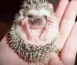
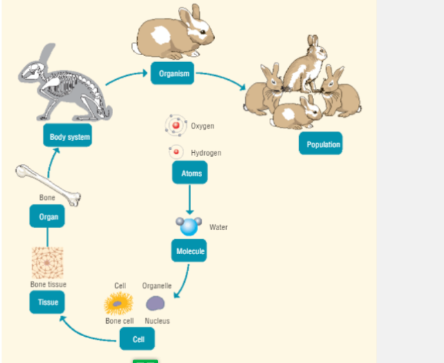

# (A Search for a) Definition of Life & Characteristics of Life

All organisms have many features or characteristics in common

# The Variety of Life

All living things are divided into two main groups

1. Plants

2. Animals

## The Animal Kingdom

## The Diversity of Animals

- There are more than a million different species of animals on earth
- Scientists have organised all these animals according to how they are related
- The animal kingdom is divided into groups called classes

For example: Reptiles, Birds, Mammals

These all have similar features which distinguish them from animals in other classes

### Vertebrates

Vertebrates have a back bone

- Fish

- Reptiles

- Birds

### Invertebrates

Invertebrates don't have a back bone

- Worms

- Insects

- Arachnids

## The Diversity of Plants

- Algae

- Moss

- Flowering Plants

- Ferns

- Conifers 

## What is life?

Bio = Living

Biology = Study of living things

There are many different branches of Biology

Zoology = Animals

Botany = Plants

Microbiology = Micro-organisms

---

Biodiversity = the range of different types of organisms (living things) in an area

---

# Characteristics of Living Things

1. Organisation = Organisms are highly organised and are composed of tiny units called cells
2. Feed (nutrition)
3. Excretion
4. Responsiveness (react to their surroundings)
5. Reproduce

*Not accepted in exam: Growth, respiration, movement*

The Definition of Life = The possession of all above characteristics

## Metabolism

Metabolism = The chemical reactions that occur in the cells of living organisms

These reactions are responsible for the process of:

- Growth
- Repair
- Responsiveness
- Reproduction

All living things metabolise

## There are 2 types of Metabolic Reactions

### Anabolic Reactions

These reactions use energy to join small molecules together to form larger molecules

Anabolic: small → big

Example: Photosynthesis

Photosynthesis Formula: Carbon dioxide + water → glucose + oxygen

6 CO2 + 6 H2O + light --> C6H12O6 + 6 O2

### Catabolic Reactions

These reactions use energy to break down large molecules into smaller ones

Catabolic: small ← big

Example: Respiration

## Continuity of Life

*Continuity of life is the ability of an organism to exist from generation to the next*

You need reproduction and heredity to achieve continuity

Genes are hereditary factors that are passed on from one generation to the next during reproduction

All living things reproduce

Viruses are not living because they don't have cells (we will come across this again later)

### Terminology

| Term                 | Definition                                                                       | Examples                                                                  |
|----------------------|----------------------------------------------------------------------------------|---------------------------------------------------------------------------|
| Organisation         | Living things are composed of cells, tissues, organs and organ system        |                                                                           |
| Growth               | An increase in the size or number of cells of an organism                        |                                                                           |
| Nutrition            | The way organism obtain (get) and use food                                       |                                                                           |
| Excretion            | The removal of the waste products of metabolism from the body                    |                                                                           |
| Response             | The activity of a cell or organism as a result of a stimulus                     |                                                                           |
| Reproduction         | The ability of an organism to make new organisms of the same type                |                                                                           |
| Cells                | The basic unit of living things and contain smaller structures called organelles |                                                                           |
| Tissues              | Groups of similar cells working together to carry out a particular function      | Muscle tissue and the xylem tissue in plants (the stringy bits in celery) |
| Organs               | Groups of different tissues working together to carry out a particular function  | Brain and flowers                                                         |
| Organ Systems        | Groups of organs that work together to carry out a particular function           | Circulatory System                                                        |
| Organisms            | Individual living entities                                                       | Unicellular: bacteria, Multicellular: humans                             |
| Asexual Reproduction | Reproduction that doesn't require sex cells or fertilisation. Only one parent |                                                                           |
| Sexual Reproduction  | Reproduction that requires sex cells or fertilisation. Two parents             |                                                                           |
| Herbivore            | Animals that only eat plants                                                     | Cow                                                                       |
| Carnivore            | Animals that only eat meat                                                       | Fox                                                                       |
| Omnivore             | Animals that eat plants and meat                                                     | Human                                                                     |

### Organisation Diagrams

### Nutrition Diagrams

### Response Diagram

### A mnemonic device to learn all the characteristics of life

| Mnemonic                    | Word                                                         |
|-----------------------------|--------------------------------------------------------------|
| One                         | Organisation                                                 |
| Nutty                       | Nutrition                                                    |
| Elephant                    | Excretion                                                    |
| Ran                         | Response                                                     |
| Riot                        | Reproduction                                                 |
| One nutty elephant ran riot | "Organisation, nutrition, excretion, response, reproduction" |

## Section Recap Videos
- [How to Study Characteristics of Life](https://youtu.be/1HTdcNvMlZI)
- [Characteristics of Living Things](https://youtu.be/h_2eykxl-dw)
