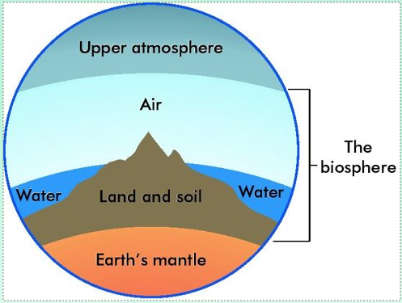
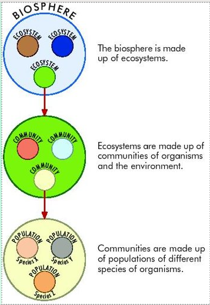
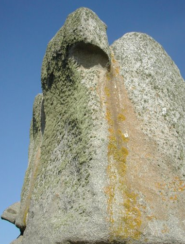

# Ecology, Ecosystem, Biosphere, Habitat & Niche

## Need to Know

1. Define the term: ecosystem
2. Name a range of ecosystems​
3. Explain the term: biosphere
4. Define the term: habitat
5. Name examples of habitats
6. Explain the term niche and give examples

## Ecology

**Ecology** is the study of how living things relate to each other and to their environment

Their **environment** refers to all the conditions in which the organism lives, which affect the growth and development of the organism

## Ecosystem

An *ecosystem* is a **community** of living organisms interacting with one another and their **non-living environment** within a particular area

The earth itself is a true ecosystem as no part of it is completely isolated from the rest

*Ecosystem* = Communities + Environment

### Diversity of Ecosystems

- Woodland
- Seashore
- Grassland
- Hedgerow
- Marine
- Freshwater
- Tree
- etc.

Ecosystems can be very large

### To study and ecosystem

We divide the ecosystem into a number of smaller, more manageable areas (habitats)

Individual *habitats* are then studied

## Biosphere

The biosphere is that **part of the earth inhabited by living organisms**, including land, ocean and the atmosphere in which life can exist

It is the global ecosystem

## Relationships in the biosphere

## Habitat

A habitat is the particular place within the ecosystem **where an organism lives** and to which it *is adapted*

## Summary

| Term | Definition |
|-|-|
| Biosphere | that part of the earth and its atmosphere in which life can exist composed of ecosystems |
| Ecosystems | composed of communities of organisms and their environment |
| Communities | populations of different species of organisms |
| Habitats | is the place where an organism lives and to which it is adapted  |

## Niche

### Simple Definition

A **niche** is the functional role of an organism in an ecosystem

Example: Niche = Insects are located on forest floor (breakdown leaves)

Leaves of tree positioned in canopy (Access to sunlight)

### Niche Explanation

A **niche** is a term describing the relational position of a species or population in an ecosystem

This includes how a population responds to the abundance of its resources and enemies​ (e.g. by growing when resources are abundant, and predators, parasites and pathogens are scarce) ​and how it affects those same factors (e.g. by reducing the abundance of resources through consumption and contributing to the population growth of enemies by falling prey to them)

The abiotic (non-living) or physical environment is part of the niche because it influences how populations affect, and are affected by, resources and enemies

The description of a niche may include descriptions of the organism's life history, habitat, and place in the food chain

No two species can occupy the same niche in the same environment for a long time.

When plants and animals are introduced into a new environment, they can occupy new niches or niches of native organisms, outcompete the native species, and become a serious pest

## Lichens

Two lichens on a rock, in two different ecological niches

## Summary

For a species to maintain its population, its individuals must survive and reproduce

Certain combinations of environmental conditions are necessary for individuals of each species to tolerate the physical environment, obtain energy and nutrients, and avoid predators

The total requirements of a species for all resources and physical conditions determine where it can live and how abundant it can be at any one place

These requirements are termed the **ecological niche**

## Interesting Historical Note​

Charles Sutherland Elton, a British ecologist, gave the first working definition of the niche concept. ​

He was credited of saying "when an ecologist sees a badger, they should include in their thoughts some definitive idea of the animal's place in the community to which it belongs, just as if they had said 'there goes the vicar'"