# Environmental Factors

## Environmental factors that affect organisms

| Environmental Factor | Definition                                                                         |
|----------------------|------------------------------------------------------------------------------------|
| Abiotic              | These are non-living factors                                                       |
| Biotic               | These are living factors                                                           |
| Climatic             | These are the average weather conditions that affect the community in an ecosystem |
| Edaphic              | These refer to the soil                                                            |

(* is what effects humans (I am not sure on this thought))

## Abiotic Factors

These are the non-living features of an ecosystem (i.e the physical and chemical conditions) that affect the community

### Abiotic Factors Include

- Temperature *
- Light intensity *
- Air speed
- Water current
- Humidity *
- pH *
- Dissolved oxygen
- Salinity
- Nitrate, phosphate and other plant nutrients

## Abiotic factors in a woodland

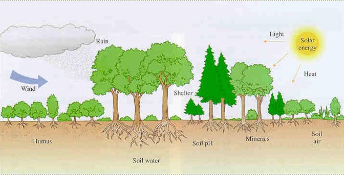

## Biotic Factors

These are the living features of an ecosystem that affect the other members of the community

### Biotic Factors Include:

- Plants for food and shelter *
- Predators *
- Prey *
- Parasites and pathogens
- Decomposers (Fungi - return minerals to the soil)
- Competitors *
- Pollinators *

## Climatic Factors

These are elements of the climate (weather) that influence the life and distribution of the organisms that live in a particular environment

### Climatic Factors Include

- Temperature *
- Rainfall *
- Humidity *
- Wind
- Light intensity (including seasonal variations) *
- Day length

## Edaphic Factors

These are the physical, chemical and biological characteristics of the soil that influence the community

### Edaphic Factors Include

- Soil type *
- Soil pH *
- Available (soil) water *
- Air and mineral content *
- Humus
- Soil texture and structure

## Aquatic Environmental Factors

The following are also considered as factors:

- Light penetration
- Currents
- Wave action

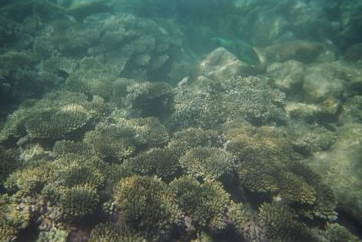

# Energy Flow

## What is an **ecosystem**?

A community of living organisms interacting with one another and their non-living environment within a particular area e.g. woodland, etc.

## Energy Flow

Ecosystems are unable to function unless there is a constant input of energy from an external source

Where does this energy come from?

The **Sun** (Primary source of energy)

### The Sun

The **sun** is the **primary source** of energy for our planet

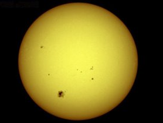

Energy Flow is the **pathway** of energy transfer from one organism to the next in an ecosystem due to feeding, e.g. along a food chain

*Feeding* allows energy to flow from one organism to another in an ecosystem

## Energy Flow in the Ecosystem

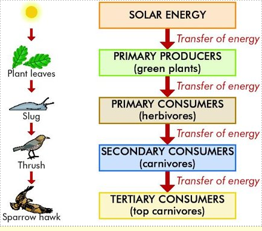

Producer = Organism that makes it’s own food e.g. plants

Consumers = Organisms that cannot make their own food

### Food Chain

is a flow diagram that begins with a plant and shows how food/energy is passed through a series of organisms in a community

Each organism feeds on the one before it

A food chain ends when there is not enough energy to support another organism

An example of a food chain: grass -> rabbit -> fox

### A Grazing Food Chain

is one where the **initial plant is living** e.g.

Grass → grasshoppers → frogs → hawks

Honeysuckle → aphids → ladybirds → thrushes

Seaweed → winkles → crabs → herring gulls

Phytoplankton → zooplankton → copepod → herring

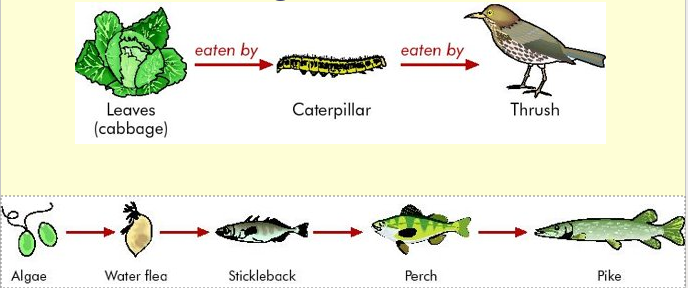

## A Detritus Food Chain

is one where the chain begins with **dead organic matter** and animal waste (detritus) e.g.

Detritus → edible crab → seagull

Fallen leaves → earthworms → blackbirds → hawks

## Food Web

This is a chart showing all the **feeding connections** in the habitat/ecosystem

Constructed by showing the links between all the interconnection food chains in the habitat

The interconnected food chains in an ecosystem

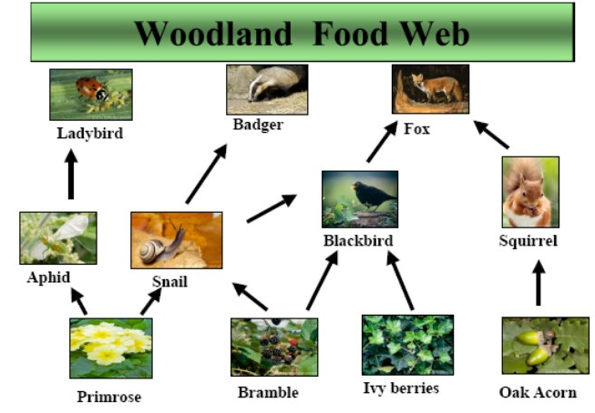

### A woodland food web

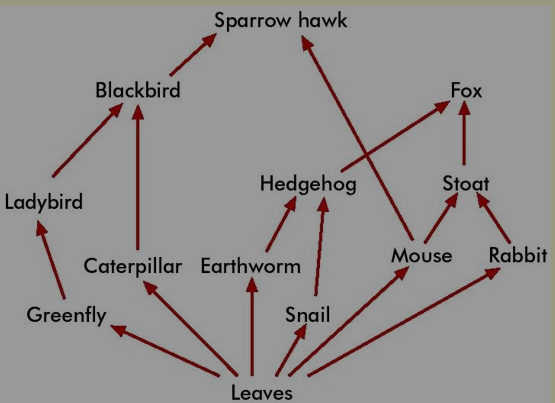

### Another food web

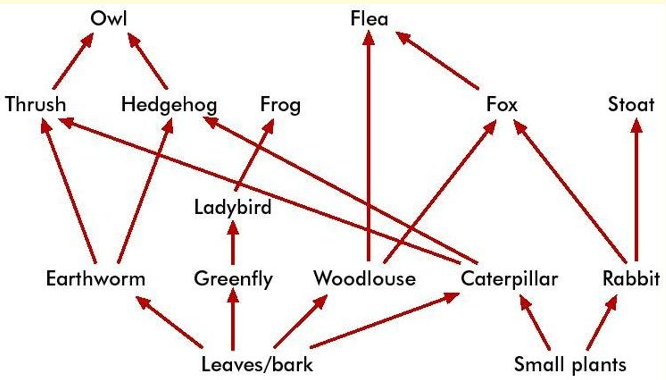

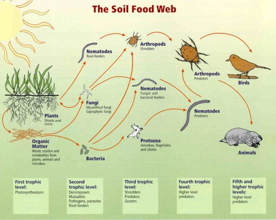

## Producers

**Producers** are organisms capable of making their own food by photosynthesis, e.g. green plants

**Primary producers** are the first members of a food chain

## Consumers

**Consumers** are organisms that feed on other organisms. They cannot make their own food. There are three types:

- **Primary consumers** - feed on producers
- **Secondary consumers** - feed on primary consumers
- **Tertiary consumers** - feed on secondary consumers

### Woodland food chain

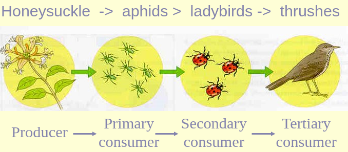

## Trophic Level

This refers to the **position** of an organism in a food chain

Plants are at the 1st trophic level (T1) and Herbivores occupy the 2nd trophic level (T2)

Carnivores that eat herbivores are at the 3rd trophic level (T3)

The 4th trophic level (T4) is often occupied by the top carnivore

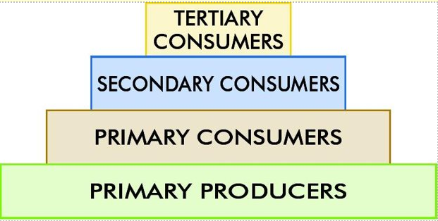

### Pyramid of Numbers

**A diagram that represents the numbers of organisms at each trophic level in a food chain**

Bottom layer is the largest and represents a very large number of primary producers

The next layer smaller and represents a smaller number of primary consumers

The next layer - the no. of secondary consumers

The uppermost layer where there may be only one tertiary consumer

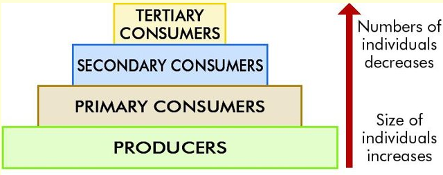

### To construct a pyramid of numbers

1. Count the primary producers and place them at the base of the pyramid
2. Count each consumer and include them according to their status (primary or secondary consumer) in the pyramid
3. The apex of the pyramid should include tertiary or top carnivores
4. Draw the pyramid so that the area/volume of each level is proportional to the number of organisms found
