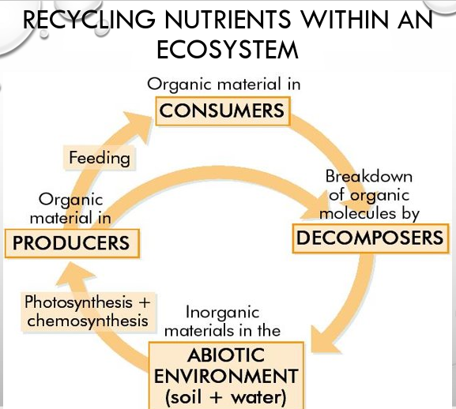
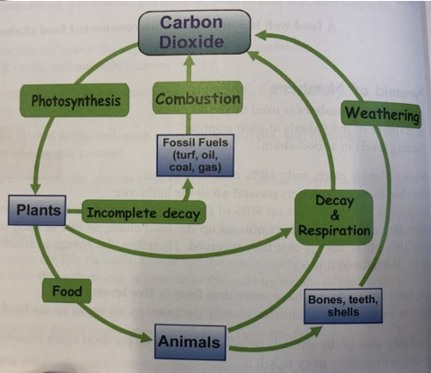
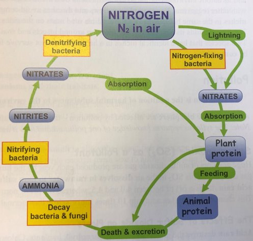
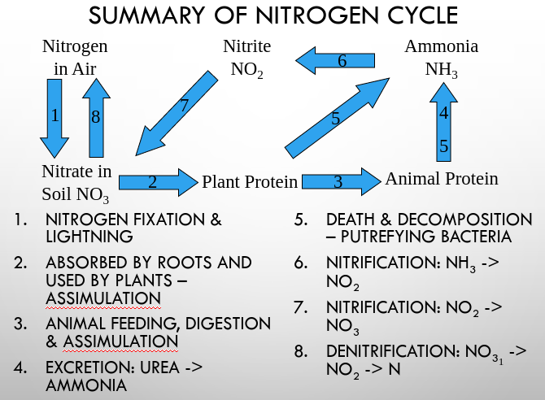
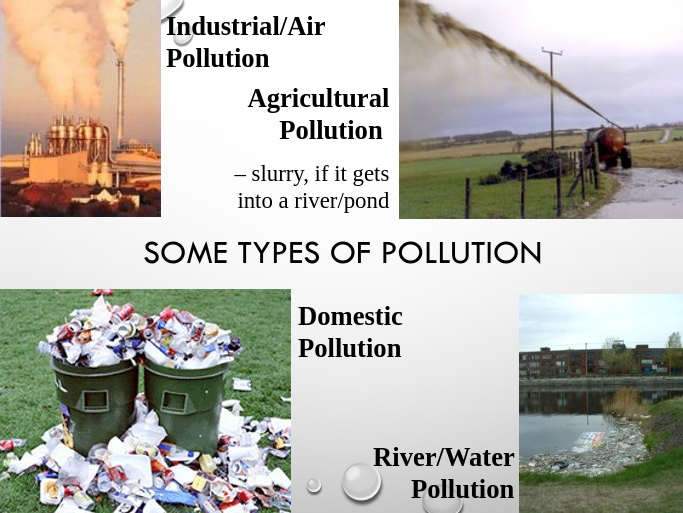
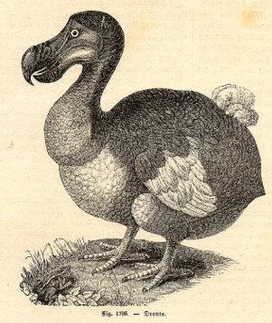
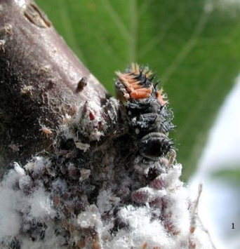
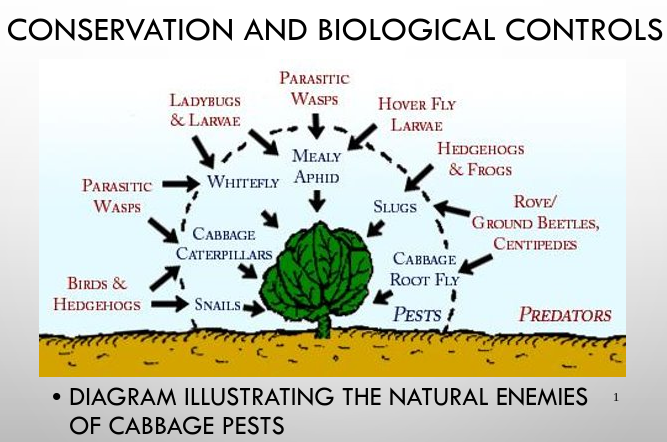
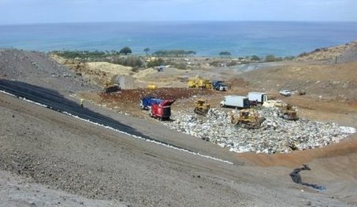

# Nutrient Recycling

## Need to Know

1. Define the term: nutrient recycling by organisms
2. Outline and draw the carbon cycle
3. Outline and draw the nitrogen cycle

## Nutrient Recycling

There is a **limited** amount of **nutrients** in Earth e.g. you are probably aware of the water cycle - where water is constantly being **recycled** in nature. There are similar cycles for all nutrients

When plants and animals die, their nutrient content is **not wasted**

Bacteria and fungi decompose the remains and release the nutrients back into the abiotic environment (i.e. into the soil, nearby water and air)

These nutrients are then taken up by other plants and used to make new organic material

This material is passed on down the food chains and is reused by all the chain members

When death occurs for these members, the nutrients are again returned to the abiotic environment and the cycling of nutrients continues in this circular way

This ensures that there is no real long term drain on the Earth's nutrients, despite millions of years of plant and animal activity

## The Carbon Cycle

**Carbon** forms part of all organic nutrients - carbohydrates, fats and proteins

Carbon Dioxide is <u>removed</u> from the environment by *photosynthesis* in plants, and under certain conditions, over long periods of time, some of these plants may form *fossil fuels* such as coal, oil, peat, and natural gas

Carbon dioxide is <u>returned</u> to the environment by:
1. **Respiration** in plants, animals & micro-organisms
2. **Decay** caused by micro-organisms
3. **Combustion** i.e. burning fossil fuels

## The Nitrogen Cycle

All organisms need **nitrogen** for protein, DNA and RNA manufacture

78% of the Earth's atmosphere is nitrogen gas, but it cannot be used in this form by plants and animals

Nitrogen gas must first be 'fixed', i.e. changed to a suitable form (ammonia or nitrate) before it can be used

### Nitrogen Fixation

- **Nitrogen-Fixing bacteria** in the soil convert N₂ gas in the air into ammonia (NH₃). This accounts for the majority of all N₂ fixation
- **Lightening storms** and fuel burning in car engines produce nitrates, which are washed by rain into the soil water
- **Nitrates** are <u>absorbed</u> by plant roots and converted to plant protein

## The Nitrogen Cycle

- Plant proteins are passed along food chains to become animal protein
- When organisms die, their proteins are converted to ammonia by bacterial decomposition
- **Nitrifying bacteria** in the soil then convert ammonia (NH3) into nitrites (NO22-) then into nitrates (NO3-)
- Nitrates can be absorbed by other plants to continue the cycle

- **Denitrifying bacteria** convert soil nitrates into N2 gas

    This is a **loss** of N2 from the cycle

    Only happens in anaerobic conditions (when O2 levels are low) – due to flooding or accumulation of sewage

- Nitrate also **enters** the cycle through the addition of nitrogen rich fertilisers to the soil – made industrially from nitrogen gas

## Summary of Nitrogen Cycle

1. Nitrogen (N₂) in the air is converted to Nitrates (NO⁻ ₃) by Nitrogen Fixing Bacteria / lightning and are absorbed by plants + eaten by animals
2. Animals excrete Ammonia (NH₃) and release it when they die
3. Nitrification - Bacteria turn Ammonia (NH₃) into (nitrites (NO⁻ ₂) and then turn into) Nitrates (NO⁻ ₃)
4. Denitrifcation - Bacteria turn Nitrates (NO⁻ ₃) into Atmospheric Nitrogen (N₂)

# Human Impact on an Ecosystem 1: Pollution

## Need to Know

- Define the term: Pollution
- State areas affected by pollution
- State mechanisms to control pollution
- Explain the difference between the terms: pollutant and pollution
- Discuss the ecological impact of one human activity

## Human Impact on Ecosystem

We are going to look at 3 ways that humans affect ecosystems:

1. Pollution
2. Conservation
3. Waste Management

**Note:** from Syllabus Clarifications – Pollution must be related to habitat studied

## Pollution

<u>Pollution is any human addition (contamination) to a habitat or the environment that leaves it less able to sustain life</u>

It is the most harmful human impact and affects air, fresh water, sea, soil and land

<u>Chemicals of human origin that harm the environment are called **pollutants**</u>

<u>CO2 released during respiration is not a pollutant</u>

## From the Syllabus & Guidelines

The Syllabus states: “Study the effects of any **one pollutant**”​
The Guidelines for Teachers states: “Give the effects of one pollutant from **any** of the following areas: **domestic, agricultural, industrial**” and​

“Give an example of **one** way in which pollution may be **controlled** in the selected area”​

What follows is only a sample of the pollutants available

### Effect of one pollutant from one area​ - Agricultural, Industrial or Domestic

| Area | Type | Source | Effect |
|-|-|-|-|
| Domestic | Plastic Bags | Shopping | Non-biodegradable, Suffocate small animals, Litter |

### Control of Pollutants, ​in the selected area - Agricultural, Industrial or Domestic

| Area | Type | Control Measure |
|-|-|-|
| Domestic | Plastic bags | Bag tax/levy. Reuse/Recycle bags |

# Human Impact on an Ecosystem 2: Conservation

Have you seen one of these recently?

It is a Dodo and has been extinct since 1681

How did it happen?

## What happened to the Dodo?

{Not examinable}

- In 1598 Portuguese and Dutch sailors were the first people to live on the island of Mauritius
- With them they brought pigs, dogs, rats and even monkeys
- They killed dodos for food and by 1681 (83 years later) they were extinct

[A article on the Relationship of the Dodo Bird and the Calvaria Tree {**Not examinable**}](http://www.kidzworld.com/article/353-history-the-dodo-bird)

## What is Conservation?

<u>Conservation is the protection and wise management of natural resources, organisms and the environment</u>

### Benefits of Conservation

1. Existing environments are maintained
2. Endangered species are preserved for reproduction
3. The balance of nature is maintained
4. Pollution and its effects are reduced

### One conservation practice from one of the following areas

| Area | Conservation Practice |
|-|-|
| <u>Agriculture</u> | Mixed farming, Crop rotation​, Biological controls, Gene banks |
| <u>Fisheries</u> | Fishing Net size, Quotas, Re-stocking |
| <u>Forestry</u> | Re-planting, Broadleaf/conifer mix |

There is a need for continual monitoring of the environment to ensure its protection and the wise management of its natural resources

#### Agriculture

One conservation practice from one of the following areas is required:

- <u>Mixed Farming</u>
- <u>Crop Rotation</u>
- <u>Biological Controls</u>
- <u>Gene Banks</u>

### Biological Controls

**What are Biological Controls?**

<u>Biological Control is a method of controlling pests (including weeds) and diseases in agriculture that uses living organisms</u> (predation, parasitism) <u>rather than introduced chemicals</u>

#### Conservation and Biological Controls

- Ladybird larva eating woolly apple aphids

**Advantages:**

- No chemical used
- No chemical residues left on plants
- No leaching of chemicals into soil or water courses

# Human Impact on an Ecosystem 3: Waste Management

## Need to Know

- State problems associated with waste management & disposal
- Explain the importance of waste minimisation
- Explain the role of microorganisms in waste management and pollution control

## Waste Management

**What is waste management?**

**Waste Management** is the collection, transport, processing, recycling or disposal of waste materials, produced by human activity, in an effort to reduce their effect on human health or local aesthetics or amenity

It also tries to reduce waste materials' effect on the natural world and the environment and to recover resources from them

Urban rubbish is mostly dust, dirt, hair, paper, food scraps, metal, glass and plastic

Traditional disposal has been to bury rubbish in landfill sites or incinerate

### Landfill Operation

The area being filled has a <u>rubberized landfill liner</u> in place (exposed on the left in photo)

This prevents leaching materials migrating downward through the underlying rock

### One of the following is necessary

Waste Management in:

Agriculture **OR** Fisheries **OR** Forestry

### Waste Management in forestry

1. <u>Leaves from coniferous</u> trees should not be allowed fall into <u>rivers</u> – <u>make the water acidic​</u>
2. <u>Chemicals and fertilisers should not be allowed run off into waterways</u> - *algal blooms* and *eutrophication*
3. When trees are harvested only bare poles are removed so a lot of tree debris (called brash) and <u>the stumps are left behind</u>

#### Forestry Solutions

- Waste Management in the forestry sector is <u>all based on recycling</u>
- When the trees are harvested brash and the stumps are left behind
- The stumps are sprayed with a <u>urea-type compound</u> which speeds up the <u>decomposition process</u>

### Problems with Waste Disposal

- Availability of suitable landfill sites​
- The toxic or polluting content of fumes from incineration (CO2, other acidic oxides and dioxins – produced from burning plastic)​
- Decaying waste produces methane gas which contributes to the “greenhouse gases”

#### Possible Solutions

- Lifestyle changes and education programmes for all ages are needed to alter the attitudes to littering and waste minimisation and disposal​
- Use micro-organisms to degrade the rubbish and produce fuel pellets​
- Biodegradable materials (e.g. paper bags) should be used in place of plastic ones

### Suggestions for Waste Minimisation

- <u>Reduce – use less, minimise waste</u>
- <u>Re-use</u> – use again, without changing but maybe for a different purpose
- <u>Recycle</u> – change, recover some material and use again

## Role of Micro-organisms in Waste Management

- <u>Composting is an aerobic process during which micro-organisms decompose organic matter into</u> (a stable substance called) <u>compost</u> which recycles all the nutrients required for plant growth
- Since it is aerobic the organic waste mixture must be turned and loosened to allow air into it
- This increases the size and number of air pores
