# Pyramid of Numbers

## Use of Pyramid of Numbers

Ecological pyramids are used to compare different communities of the ecosystem by comparing trophic levels and looking at energy structure by counting individuals at each level

## Pyramid of Numbers

In general:

- Number of organisms declines as you go up t​he pyramid
- Due to large energy loss (about 90%) between each trophic level​
- Less energy available to organisms higher up the pyramid
- Loss of energy and body size increase as you go up the pyramid (Reason chains contain no more than 4 or 5 levels)

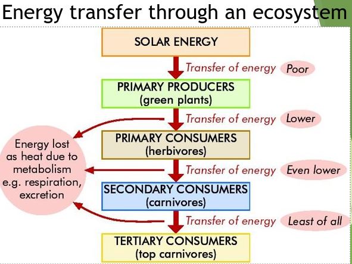

## Normal Pyramid of Numbers

A reminder of what a pyramid of numbers looks like

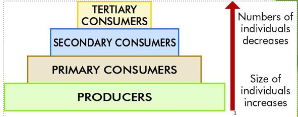

## Limitations of use

<u>The size of organisms is not consider in a pyramid of numbers e.g. one rose bush can support thousands of greenfly</u>

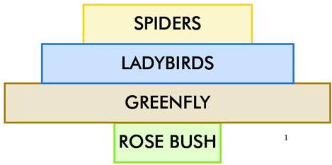

## A Distorted Pyramid of Numbers

A similar problem arises with parasites - numerous parasites on one host - resulting in a distorted pyramid

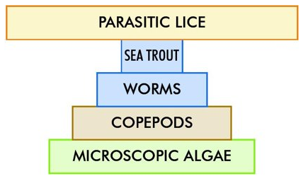

## An Inverted Pyramid of Numbers

When organism size is not considered very unusual pyramid shapes are likely to occur

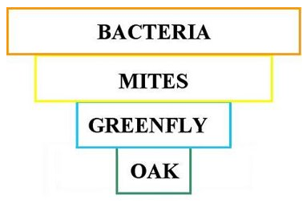

## Another Example

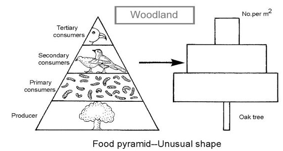

## Last Example

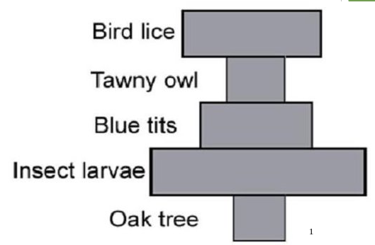

# Ecologoical Relationships

## Factors that control population

1. Competition​
2. Predation​
3. Parasitism​
4. Symbiosis

These factors help maintain population numbers and bring about a ‘balance of **nature**’

## Population

<u>Def: Population - A group of individuals of the same species living together in a habitat</u>

​They live in populations for the following reasons:

- Their habitat provides food and shelter​
- Individuals are safer in a group​
- The availability of a mate for breeding purposes

## Competition

<u>Def: Competition-When organisms of the same or different species ‘fight’ for necessary resources that are in short supply</u>

Intra-specific competition:
- Between members of the <u><b>same species</b></u> i.e. within a species

Intra-specific competition:
- Between members of <u><b>different species</b></u>

### Competition for resources

Plants:

- compete for light
- water
- minerals
- space

Animals:

- compete for food
- water
- shelter
- territory
- mates

### Two types of competition
#### 1. Contest Competition

<u>This involves an active physical confrontation between two organisms - one wins</u>

Example:

- <u>Two dogs fighting over a bone</u>
- One may have stronger muscles and sharper teeth and so win the bone

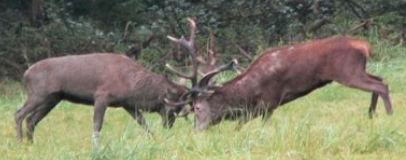

#### 2. Scramble Competition

<u>This is where each organism tries to acquire as much of the resource as possible</u>

Example:

- <u>An ivy plants and a hawthorn tree may compete for light</u>
- The ivy uses adventitious roots to grip the hawthorn and climb higher

##### Adventitious Roots

Adventitious root: root that does not develop from the radicle

Example:

1. climbing roots of ivy
2. roots of cuttings that arise from a node

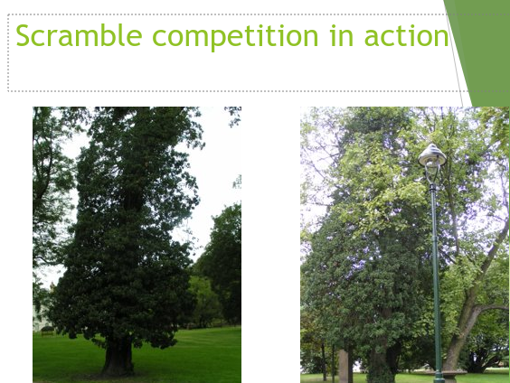

## Competition and Population Size

- <u>Restricts population</u> size
- Survival of the fittest
- Is a driving force behind evolution i.e. **adaptive techniques** (sharp teeth of carnivores or climbing abilities in ivy)

## How do animals survive competition?

They adapt to their environment by:

- Changing their feeding habits​
- Camouflage​
- Producing protective coats​
- Moving away from over-populated areas
- Reproductive strategies e.g. Kangaroo can carry up to three offspring
    1. Joey
    2. New born baby (2.5 cm long)
    3. Fertilized Egg sitting in tubes to go to womb

## How do plants survive competition?

e.g. weeds (i.e. plants growing in a place where they are not wanted)

These compete with other plants for water, minerals and light and will survive because:

- They produce large numbers of seeds
- Seeds germinate quickly, even in poor soil
- Plants thrive even in poorer soil conditions

## Adaptive Techniques

Adaptive techniques are adaptations which have evolved (developed) in response to the need to survive competition

Examples:

1. sharp teeth of carnivores
2. climbing abilities in ivy

### Adaptation

Adaptation = a inheritable trait that helps an organism survive

Types of adaptation

1. Structural - giraffes have long neck​
2. Competitive - fighting for a mate​
3. Behavioural-  Male birds like peacocks perform mating dances!!!

## Predation

**Predation**: the act, of some animals (predators), of capturing and killing other animals for food

**Predator**: animals that hunts, captures and kills other animals (prey) for food

Predators have evolved adaptive techniques to survive, e.g. a wolf has keen hearing and eyesight, strong muscles, sharp teeth, camouflage and hunts in packs

### Positive Effects of Predation

1. Stabilises the community. Keeps population numbers under control
2. Predators control the number of herbivores and so prevent overgrazing
3. Predators eliminate the less well adapted (weaker) prey

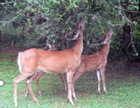

### Adaptations of Predators

- Keen senses and sharp teeth
- <u>Catch easiest prey - old and sick (less energy used)</u>
- Change diet to suit prey available e.g. foxes
- <u>Live and hunt in packs</u>
- Migrate to where prey is plentiful
- <u>Camouflage</u>

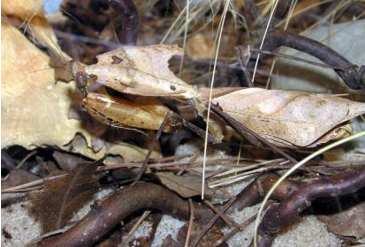

Five examples of Adaptations of Predators:

1. Hawks have excellent eyesight
2. Ladybirds have strong mouth parts
3. <u>Cheetahs can run at 60 km/h</u>
4. <u>Wolves have sharp teeth</u>
5. <u>Lions have excellent sense of smell</u>

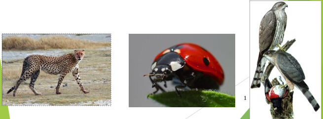

### Adaptions of Prey

Three examples of Adaptations of Prey:

1. Frogs are well camouflaged​
2. Zebras have strips, when in a group lions can’t distinguish where one ends & another begins
3. Ladybirds contain large amounts of Formic acid so they are unpalatable to taste

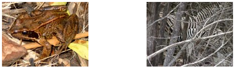

## Predator / Prey Relationship​

The populations of wolves and deer are interconnected.  Both have evolved adaptive techniques to survive

Example:

- <u>wolves</u> – keen hearing and eyesight, strong muscles, sharp teeth, camouflage and hunt in packs
- <u>deer</u> – keen hearing and eyesight, quick to turn and run and camouflage to evade the wolves

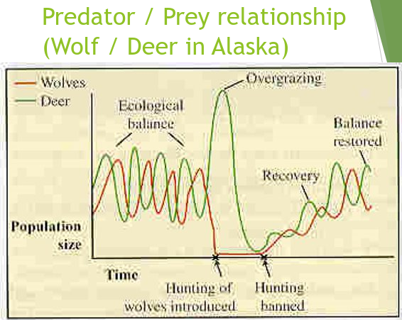

#### Notes on Graph
1. When the deer population increased, the wolf population had more food and increased too
2. As the wolf population increased, the number of deer being killed increased - resulting in a decline in the deer population
3. When the deer population declined, there was less food for the wolves and they declined in numbers too
4. This led to an increase in the deer population
5. This cycle continued over years and had obviously found a natural balance to do with availability of food for both populations
6. When the wolf population was drastically reduced due to hunting, the resulting explosion of the deer population led to overgrazing of the vegetation
7. This produced huge mortality and emigration in the deer population with a collapse of the relationship
8. After the banning of hunting, a balance was slowly re-established in the two populations

**The populations are controlled by negative feedback, where a drop in numbers is generally self-correcting**

Over a long period of time, the deer evolve structures and behaviours to survive predation better, e.g. quicker reactions, etc.

The wolves also evolve better predation techniques to cope with the evolving prey

## In Summary: Predator/Prey Relationships
- As prey **increases**, predators **increases**
- As there are more predators the prey will **decrease** and then therefore predators **decrease**
- Eventually numbers of prey will increase, starting the cycle once more

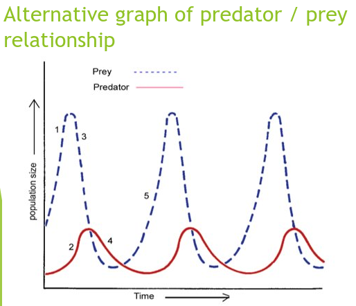

## Symbiosis

**Symbiosis (‘living together’) – where two organisms of different species have a close, specific relationship with each other where at least one of them benefits**

Parasitism is a form of symbiosis

### Example of Symbiosis

- <u>Gut Friendly bacteria produce VIT K</u>
- <u>While bacteria get shelter we get vitamins</u>
- <u>A lichen</u> is composed of an alga and a fungus intertwined
- The Alga obtains support</b></u> and a <u><b>mineral supply</u></b> from the fungus; the <u><b>fungus obtains food from the alga</u></b>

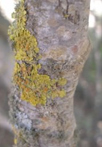

### 3 Types of Symbiosis

#### 1. Parasitism

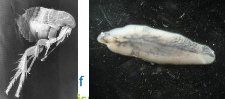

<u>Parasitism: When one organism (the parasite) benefits from another (the host) and does harm to it</u>

Examples:

- Fleas on a dog (ectoparasites)
- Liverfluke in cattle/sheep (endoparasites)

Parasites do harm to their hosts but usually do not kill them too quickly

#### 2. Mutualism

2 species living in close contact where both benefit

Example: Lichen (algae gain shelter and nutrients while fungus gains food)

#### 3. Commensalism

One species benefits while the other is neither harmed nor benefits ex- bird nesting in a tree

# Population Dynamics

## Factors that contribute to Predator-Prey relationships

### 1. The availability and abundance of food

- Large number of deer will increase the number of wolves
- This will decrease the number of deer and then wolves
- When wolves decrease deer will increase again

### 2. Concealment

When there is less prey they can hide better, this allows population of prey to survive and increase

### 3. Movement of Prey & Predators

If there is not enough food the prey will move to a more abundant location; ​predator moves to area with more prey

## Population Dynamics

A *population* is a group of organisms of the one species 

*Population density* is a measurement of the numbers of a species over a stated area

*Population increases* are due to increases in the birth rate and immigration

*Population decreases* are due to increases in the mortality rate and emigration

- Most population numbers tend to fluctuate in the short term, but find an overall balance in the long term where births and immigrations are equal to deaths and emigrations
- Mortality rates are high in nature – many organisms die before they can reproduce
- Deaths are usually due to predation, parasites and lack of food rather than old age
- A high mortality rate is important to populations – why?

It protects the stock of food and eliminates the less well-adapted organisms

## Normal Population Curve

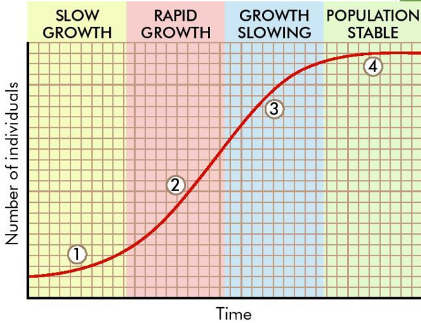

### Notes on Graph

1. Organisms arrive and then adapt to their new environment
2. Growth takes place rapidly due to newly-available food
3. Growth constraints are felt – predation, overcrowding, available food, etc
4. Growth settles at a level that the environment can support

## Human Population Curve

| Year (AD) | Population |
|-|-|
| 400 | 100 million |
| 1650 | 500 million |
| 1930s | >2 billion |
| 1970s | 4 billion |
| 2000 | >6 billion |

Population is now increasing by about 85 million per year = 230,000 per day = 160 per minute = 2.7 per second

66% of world population live in Asia. Birth rates are declining in developed countries

The increase in the human population is not due to an increase in birth rates, but is caused by reduced death rates

### Factors affecting Human Population Numbers

- Famine
- War
- Disease
- Contraception

#### Famine

- A lack of food leads to malnutrition and death due to disease or starvation e.g. ​Great Irish Famine of 1845 – 47, about one million people died
- Some countries still suffer from famine, but it is often a problem of food distribution rather than food shortages

#### ​​​Disease (modern medicine led to huge population increases)

- Vaccines – reduce the incidence of diphtheria, whooping cough, tetanus, polio, meningitis, TB, etc.​ 
- Sanitation + insecticides – have controlled malaria, yellow fever and sleeping sickness
- Antibiotics have prevented deaths that would have been caused by bacteria

#### War

- Reduces the human population
- Effects can be temporary
- Increased birth rates (baby booms) often follow wars

#### Contraception

- Increased availability has reduced birth rates since the 1960s.  Evident in developed countries e.g. in Western Europe and USA the average family size = 2.1
- This is close to the level needed to ensure the pop remains constant
- The fertility rate in *developing* countries has fallen from 6.1 in 1970 to 3.5 today, due to contraception
