# Cell Division

## Syllabus - Objectives (OL)

- Explain the terms: cell continuity & chromosomes 
- Define the terms: haploid & diploid number
- Describe the cell activities in he state of non-division: Interphase and Division (mitosis)
- Define the term: mitosis
• Explain the process in simple terms with some diagrams
• Define cancer and state causes
- State the primary function of mitosis for single-celled vs multi-cell. Organisms
- Define the term: meiosis
- State the functions of meiosis

## Cell Continuity

<u>Definition: Cell continuity (= cell division) means that all cells develop from pre-existing cells</u>

3 steps to form a new cell

1. Produce materials it will need
2. Grow larger
3. Reproduce to form a new cell

## Chromosomes

- <u>Definition: Chromosomes are structures in the Nucleus, made of DNA & Protein</u>
- Not dividing = Chromatin (long thing threads)
- When dividing = Chromatin forms a numbers of clearly distinguishable Chromosomes
- Each species has a definite no. of Chromosomes, Humans = 46 chromosomes
- Each Chromosome has 1000s of genes (Check out human genome project). Each cell in the human body contains about 25,000 to 35,000 genes

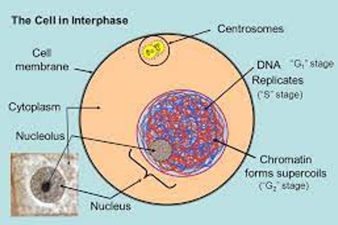

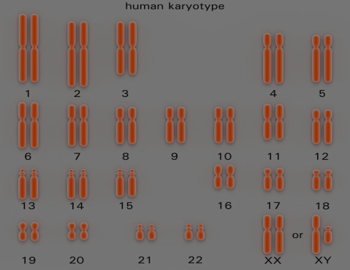

## Haploid

<u>Definition: A Haploid cell has one set of each type of chromosomes</u>, ie. has only one set of each type of chromosomes in the nucleus

Haploid is symbolised by <u>letter 'n'</u> and number of chromosomes in the cell is given as <u>n=23</u>

In humans, eggs and sperm are haploid n=23

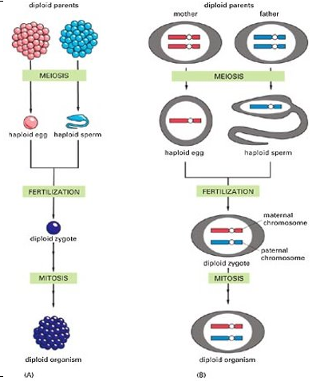

## Diploid

<u>Definition: A diploid cell has two sets of each type of chromosomes</u>, ie. It has two of each type of chromosome in the nucleus

Chromosomes are in pairs in diploid cell, called homologous pairs. (Both chromosomes same size and shape)

(Homologous = same length, similar)

Diploid is symbolised as '2n' and total no. of chromosomes in cell is given as 2n=46. This means there are 23 pairs of chromosomes

## Triploid

Definition: A triploid cell has three sets of chromosomes

## Somatic Cells

- <u>Somatic cells are normal body cells</u> of an advanced organism and contain two sets of chromosomes (not sex cells)

Somatic Cells -> Diploid
Sex Cells -> Haploid

- In diploid cells, 1 chromosome from the homologous pair comes from the mother and the other comes from the father

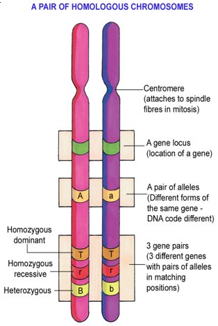

## Cell Cycle

- Describes the life of a cell. It includes the period between division when the cell is not dividing, called Interphase
- Period when a cell divides = Mitosis

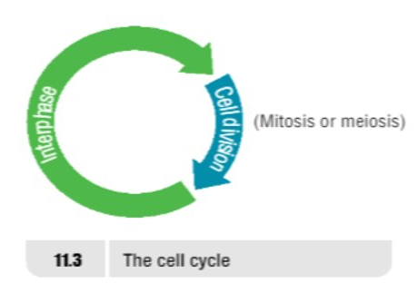

### Interphase

- <u>Longest phase</u> in cell cycle = 90% of a cells life is in interphase
- <u>Chromosomes elongated = chromatin</u>
- Cell very active in Interphase, produces new mitochondria, chloroplasts etc. and chemicals needed for growth

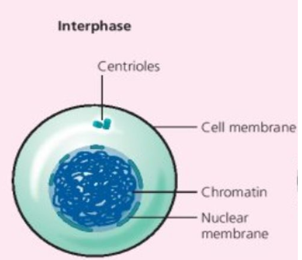

## Mitosis

<u>Definition: Mitosis is a form of nucleur division in which one nucleus divides to form two nuclei, each containing identical sets of chromosomes</u>

Two new cells called daughter cells and they are IDENTICAL to each other

### Stages of Mitosis (4 in total)

#### Stage 1 <u>Prophase (HL)</u>

- At end of Interphase, Chromosomes contract and become visible
- Each chromosome appears as a duplicated strand
- Fibres appear in cytoplasm
- Nuclear membrane starts to break down

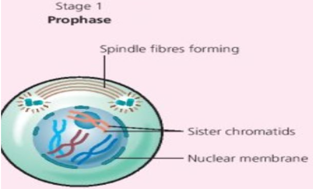

#### Stage 2 <u>Metaphase (HL)</u>

- Nuclear membrane broken down
- Chromosomes thicken even more
- Chromosomes line up across the centre of cell along equatorial plate
- Fibres produced by centrioles attach to chromosomes
- Each chromosome has 2 fibres attached, 1 from each side of the cell

#### Stage 3 Anaphase (HL)

- Fibres contract, chromosomes pulled apart
- Each strand of chromosome is pulled to opposite end of cell
- Hence, identical set of genes pulled to each end of the cell
- (Look for V shape to recognize this stage)

#### Stage 4 Telophase (HL)

- Nuclear membrane forms around each of the 2 sets of chromosomes
- Chromosomes elongate within each nucleus

Mitosis is complete

Once complete, original cell divides to form 2 cells. In reality there are 5 stages - see Pg 123 (of textbook) Cytokinesis

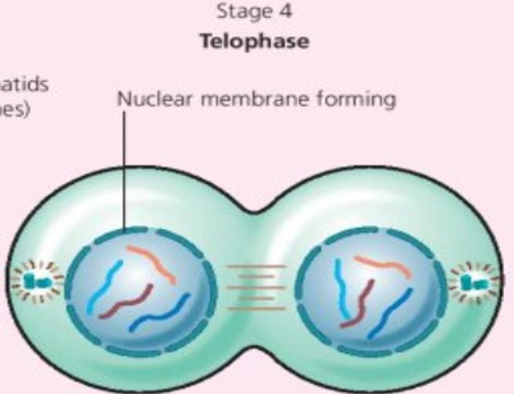

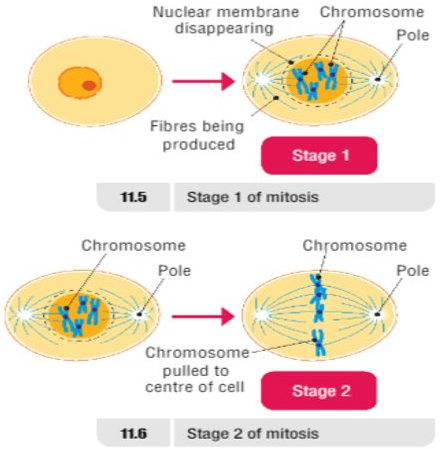

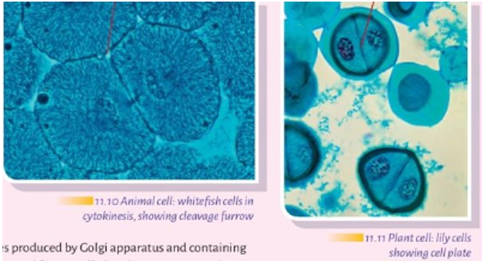

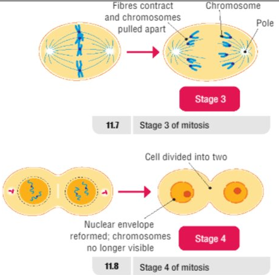

### Functions of Mitosis

**<u>In Unicellilar Organisms</u>**

- <u>Method of reproduction</u> for Amoeba Reproduction that doesn't involve the joining of 2 cells is called Asexual reproduction

<u><b>In Multicellular Organisms</b></u>

- Produces new cells, not new individuals
- <u>Responsible for growth & renewal and repair of cells</u> (growth + repair cells)

## Cancer

- Rate of cell division (mitosis) is carefully controlled 
- Sometimes a cell or group of cells lose the ability to control the rate of cell division
- They form a mass of cells called a tumour which can be benign or malignant

### Benign tumours

- Benign means <u>kind</u>, they are not life threatening and do not invade other tissues. E.g. warts, skin tags
- Cells stop dividing after some time

<u>Definition: Cancer occurs when certain cells lose their ability to control the rate of mitosis</u>

### Malignant tumours

- <u>Uncontrolled multiplication of abnormal cells</u>
- Malignant tumours (cancers) invade other cells and move around the body
- Movement of these cells called Metastasis
- Cancer cells divide indefinitely

### Causes of Cancer

- Caused when normal genes are altered to form cancer causing genes called oncogenes
- Brought about by cancer causing agents called <u>carcinogens</u> e.g. <u>cigarette smoke</u>, <u>asbestos fibres,</u>, ultraviolet radiation and some viruses
- Most cancers can be cured with Radiation (burn out cancer), Chemotherapy (Chemicals slow down mitosis) and surgery

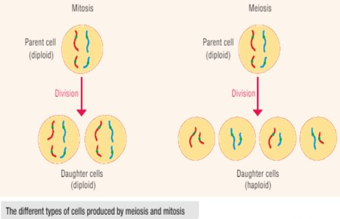

## Meiosis (2nd Type of Cell Division)

- <u>Definition: Meiosis is a form of nucleur division in which the daughter nuclei contain half the chromosome number of the parent nucleus</u>
- Humans cells (somatic cells) have 46 chromosomes
- Meiosis occurs in the ovaries and testes to produce **gametes** called eggs and sperm so there are 23 chromosomes in each egg and sperm

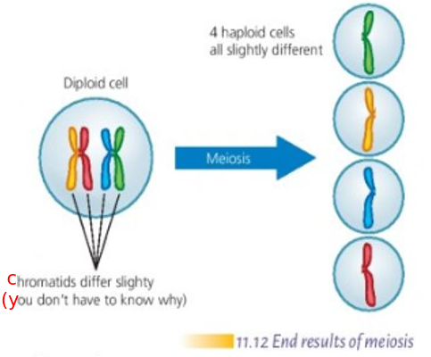

### Functions of Meiosis

<u>2 functions in Multicellular Organisms</u>

- Allows sexual <u>reproduction without increasing the number of chromosomes</u> in the offspring
- <u>Allows new combinations of genes</u>

## Differences between mitosis and meiosis

| Mitosis | Meiosis |
|-|-|
| Produces two daughter cells | Produces four cells |
| The daughter cells have the same number of chromosomes as the parent | The daughter cells have half the number of chromosomes as the parent |
| The daughter cells are genetically identical | The daughter cells are genetically different |

## Higher Level

A sentence to help you remember the 4 stages of mitosis (HL)
- **I** **P**arty **M**onday **A**nd **T**uesday

| Letter (Word) | What Letter Stands for|
|-|-|
| I | Interphase |
| P(arty) | Prophase |
| M(onday) | Metaphase |
| A(nd) | Anaphase |
| T(uesday) | Telophase |

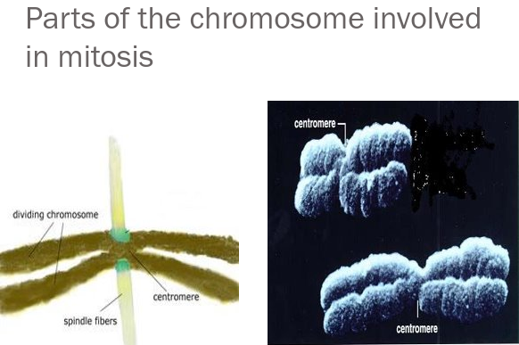
