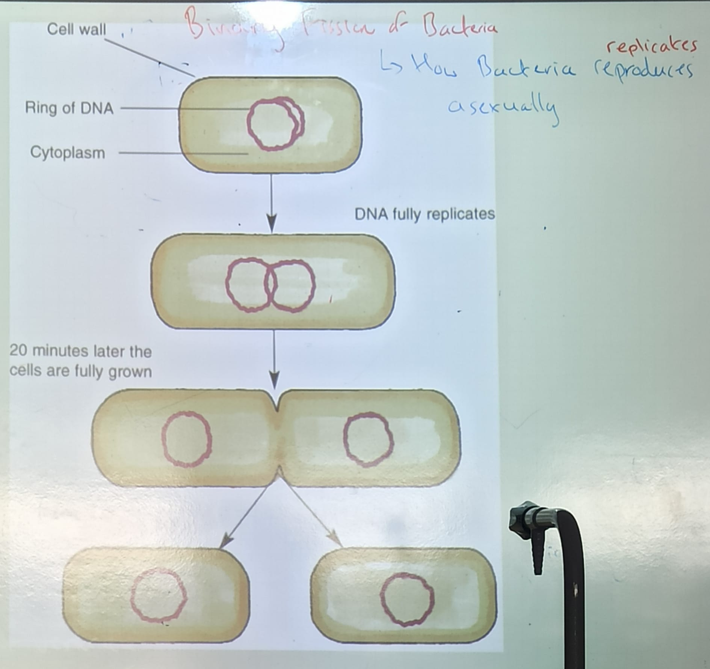
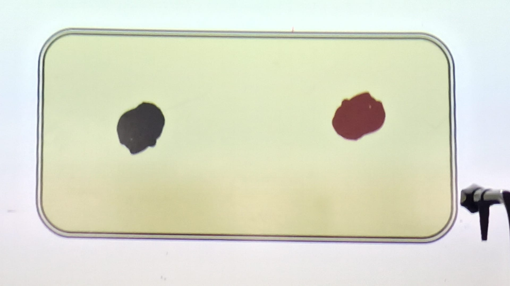
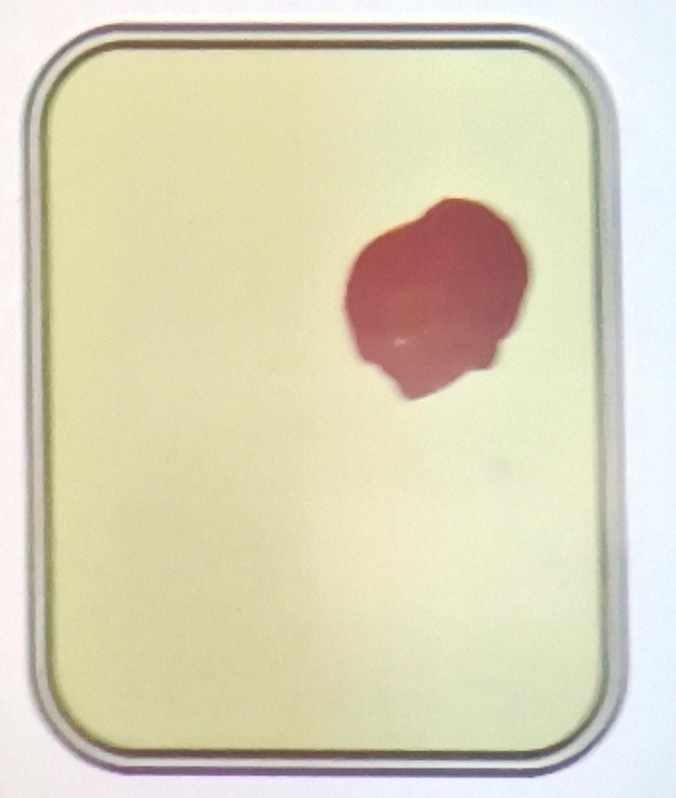
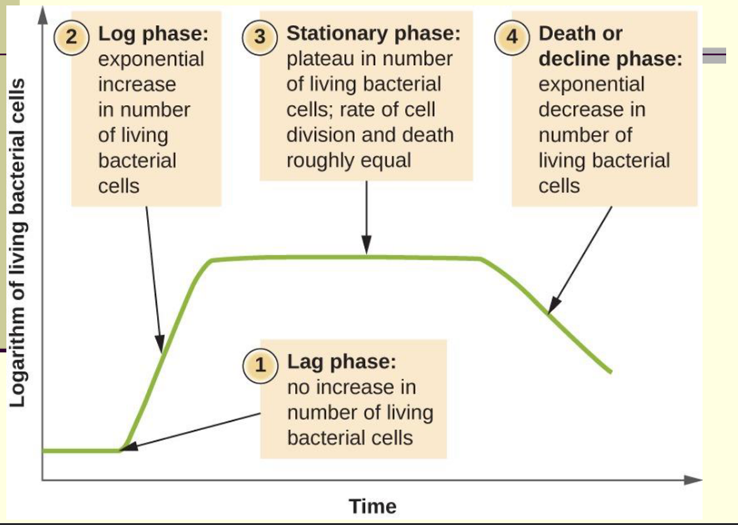
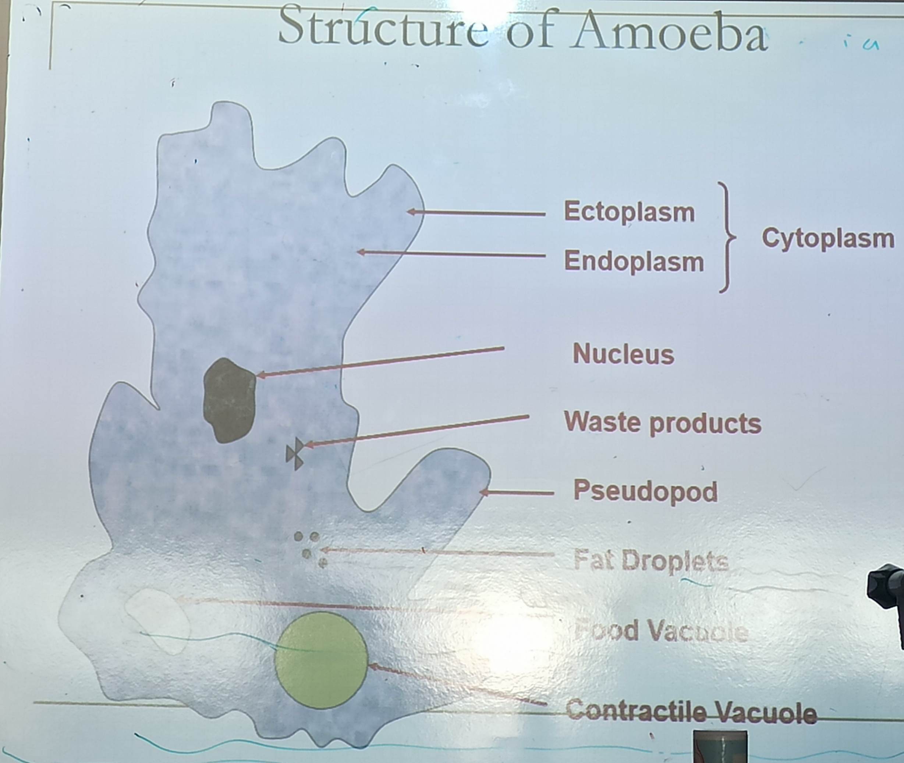

# Diversity of Organisms

## 1. Animal Kingdom

### Main Features
- All multicellular
- They are **eukaryotic** - have **a nucleus** and **membrane enclosed organelles**
- Animal calls have no cell walls
- All animals are heterotrophic - they cannot produce their own food
- They normally reproduce sexually

### Examples
- Human
- Dog
- Zebra

## 2. Plant Kingdom
- This kingdom includes the mosses, ferns and seed-producing plants
- Seed producing plants can be further sub-divided into flowering and non-flowering

### Main Features
- All multicellular
- Cell walls made of cellulose
- Cells often have large vacuoles (store food, water and wastes)
- Eukaryotic - the have a true nucleus and membrane enclosed organelles
- Chloroplasts containing the pigment chlorophyll which enables photosynthesis. All plants are autotrophs
- They reproduce asexually and sexually

### Examples
- Mosses
- Ferns
- Trees
- Rose

## 3. Monera Kingdom
- This kingdom contains about 10,000 identified species of bacteria
- It is estimated that there are many more
- Bacteria were the first organisms
- They are by far the most numerous organisms on the plant

### Main Features
- Mainly microscopic and single celled organisms
- Don't have a membrane enclosed nucleus (Prokaryote)
- They don't have membrane enclosed organelles such as mitochondria and chloroplasts

### Examples
- **Salmonella** (Food Poisoning)
- **Strep Throat**
- Tuberculosis (TB)

## 4. Protista Kingdom
- Contains a wide variety of organisms from large plant-like algae seaweeds to single-celled organisms such as Amoeba

### Main Features
- Contains single celled (Amoeba) and simple multicellular organisms (Algae)
- They have a membrane-enclosed nucleus (Eukaryote)
- Some feed by taking in organic substances (they absorb nutrients through the cell wall) (Amoeba)
- Others can produce their own food by photosynthesis (Algae)

### Examples
- Amoeba
- Algae

## 5. Fungi Kingdom

### Main Features
- Mainly multicellular
- Eukaryotes (membrane bound nucleus)
- Composed of threads called hyphae
- A Hypha consists of one or more cells surrounded bu a tubular cell wall
- Cell walls are made of a carbohydrate called chitin
- They are unable to make their own food
- Their method of reproduction involves spores

### Examples
- Mushrooms
- Mildews
- Moulds
- Yeast

## Monera (Bacteria)

- Micro-organisms are tiny organisms which can only be seen using a microscope
- Bacteria and fungi are found in stagnant water, soil, rotten carcass
- Bacteria are prokaryotes as they have no membrane bound nucleus or membrane bound cell organelles

- The 3 main types of shapes of bacteria are <!--Add images for each shape below-->
  1. **Spherical (cocci)**
    - 
    - E.g. Streptococcus (Group A)
    - Causes Strep Throat
  2. **Rod (bacillus)**
    - 
    - E.g. Lactobaccllus
    - Used in Yoghurt
  3. **Spiral (spirillum)**
    - 
    - E.g. Treponema pallidum
    - Causes Syphilis

- Bacteria reproduce asexually
  - The method used by a bacteria to reproduce is called **Binary Fission**
  - 
  - Mutations give rise to new bacteria and this allows bacteria to evolve resistance
- Some bacteria can withstand unfavourable conditions by producing endospores
  - These are formed when the bacterial chromosome replicates
  - 
  - One of the new strands becomes enclosed in a tough-walled capsule called an endospore
  - 
  - The parent cell then breaks down and the endospore remains dormant
  - When conditions are favourable the spores absorb water, break their walls and reproduce by binary fission
  - 
 
- 4 Ways that bacteria get food
  - Photosynthetic bacteria: Use light energy to make food
    - E.g. purple sulphur bacteria
  - Chemosynthetic bacteria: Use energy from chemical reactions to make food
    - E.g. Nitrifying bacteria that convert ammonia to nitrates in the nitrogen cycle
  - Saprophytes: Live off dead organic matter
    - E.g. bacteria of decay in the soil
  - Parasites: Take food from live host
    - Some causes diseases
    - E.g. Bacillus anthracis
      - Causes anthrax

- Autotrophic - organisms which make their own food
  - E.g. Plants
- Heterotrophic - organisms which take in food made by other organisms
  - E.g. Humans

- 5 factors affecting growth of bacteria
  1. Temperature (20°C - 30°C)
  2. Oxygen Concentration
  3. pH (Acidic/Basic)
  4. External Solute Concentration
  5. Pressure

- Two Economic Benefits of Bacteria
  1. Bacteria such as **Lactobacillus are used to** convert milk to products such as cheese and **yoghurt**
  2. Genetically modified bacteria e.g. **E. Coli are used to make** products such as **Insulin**, enzymes, drugs, food flavourings and vitamins
- Two Economic Disadvantages of Bacteria
  1. Bacteria can cause food spoilage
  2. Pathogenic Bacteria can cause diseases in humans and animals
    - Examples:
      - Tuberculosis
      - Anthrax
      - Thyphoid

- Pathogens are micro-organisms that cause disease
  - Examples:
    - Anthrax
    - Thyphoid

- Antibiotics are produced by micro-organisms that stop the growth of, or kill, other micro-organisms without damaging human tissue
- Antibiotics can be used to control bacterial and fungal infections but do **not** effect viruses

- **Mutations** in bacterial genes can allow bacteria to develop **antibiotic resistance**
- **Bacterial strains have emerged which are resistant to almost all known antibiotics <u>(multi-resistant)</u>**
  - As a result present day antibiotics become ineffective. 
  - E.g. **MRSA** - Type of bacteria resistant to most forms of antibiotics (Super Bug)
- Overuse of antibiotics
  - This results in the increased growth of antibiotic resistant bacteria
  - Failure of some patients to complete a course of antibiotics prescribed to them by a doctor allows the bacteria to survive and re-grow

- Bioprocessing is when we use living things cells or their parts to make useful products
  - E.g. Making Insulin (using bacteria)

- A bioreactor is a vessel in which bioprocessing happens

- A Growth Curve of a Microbial Culture
- 

- Batch Processing is when a fixed amount of nutrient medium is added to the bioreactor and all the stages of the bacteria growth curve happen
  - Then the process starts again
  - E.g. Making antibiotics

- In Continuous Flow nutrients are continuously being added and wastes removed to ensure that it is is always in the log phase
  - E.g. Alcohol Brewing

- Bacteria are prokaryotic because they don't have a true nucleus or membrane bound organelles

## Protista (Amoeba)

- Draw a diagram of an Amoeba, labelling the cell membrane, cytoplasm, nucleus, food vacuole, contractile vacuole, pseudopods, ectoplasm and endoplasm

- Describe how an Amoeba osmoregulates

- Describe the functions of the following parts of an Amoeba
  - Food vacuole:
  - Contractile vacuole:
  - Psuedopods:
  - Cell Membrane:
