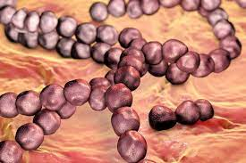
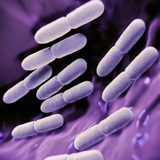
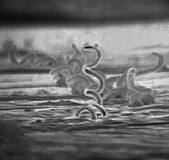
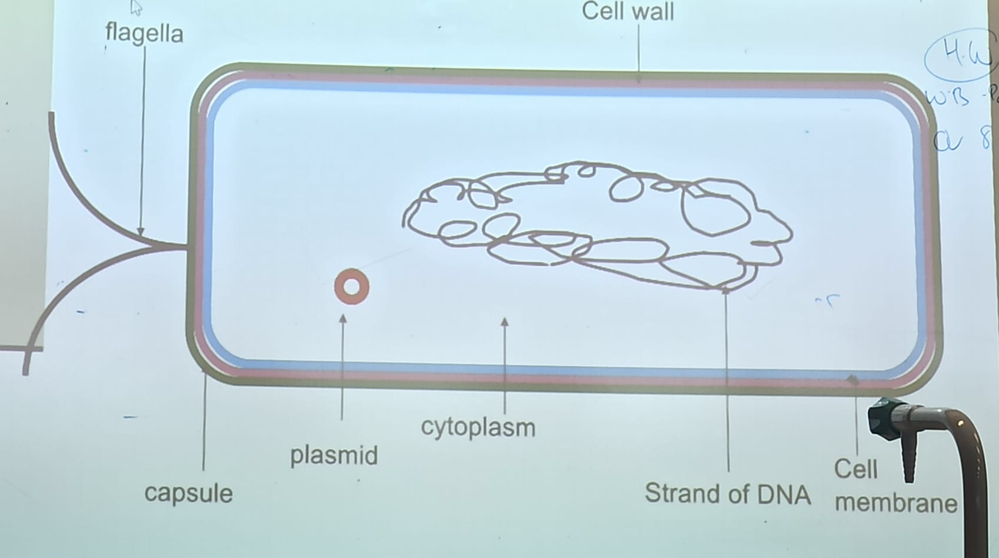

# Diversity of Organisms

## 1. Animal Kingdom

### Main Features
- All multicellular
- They are **eukaryotic** - have **a nucleus** and **membrane enclosed organelles**
- Animal calls have no cell walls
- All animals are heterotrophic - they cannot produce their own food
- They normally reproduce sexually

### Examples
- Human
- Dog
- Zebra

## 2. Plant Kingdom
- This kingdom includes the mosses, ferns and seed-producing plants
- Seed producing plants can be further sub-divided into flowering and non-flowering

### Main Features
- All multicellular
- Cell walls made of cellulose
- Cells often have large vacuoles (store food, water and wastes)
- Eukaryotic - the have a true nucleus and membrane enclosed organelles
- Chloroplasts containing the pigment chlorophyll which enables photosynthesis. All plants are autotrophs
- They reproduce asexually and sexually

### Examples
- Mosses
- Ferns
- Trees
- Rose

## 3. Monera Kingdom
- This kingdom contains about 10,000 identified species of bacteria
- It is estimated that there are many more
- Bacteria were the first organisms
- They are by far the most numerous organisms on the plant

### Main Features
- Mainly microscopic and single celled organisms
- Don't have a membrane enclosed nucleus (Prokaryote)
- They don't have membrane enclosed organelles such as mitochondria and chloroplasts

### Examples
- **Salmonella** (Food Poisoning)
- **Strep Throat**
- Tuberculosis (TB)

## 4. Protista Kingdom
- Contains a wide variety of organisms from large plant-like algae seaweeds to single-celled organisms such as Amoeba

### Main Features
- Contains single celled (Amoeba) and simple multicellular organisms (Algae)
- They have a membrane-enclosed nucleus (Eukaryote)
- Some feed by taking in organic substances (they absorb nutrients through the cell wall) (Amoeba)
- Others can produce their own food by photosynthesis (Algae)

### Examples
- Amoeba
- Algae

## 5. Fungi Kingdom

### Main Features
- Mainly multicellular
- Eukaryotes (membrane bound nucleus)
- Composed of threads called hyphae
- A Hypha consists of one or more cells surrounded bu a tubular cell wall
- Cell walls are made of a carbohydrate called chitin
- They are unable to make their own food
- Their method of reproduction involves spores

### Examples
- Mushrooms
- Mildews
- Moulds
- Yeast

## Monera (Bacteria)

- Micro-organisms are tiny organisms which can only be seen using a microscope
- Bacteria and fungi are found in stagnant water, soil, rotten carcass
- Bacteria are prokaryotes as they have no membrane bound nucleus or membrane bound cell organelles
- The 3 main types of shapes of bacteria are <!--Add images for each shape below-->
  1. **Spherical (cocci)**
    - 
    - E.g. Streptococcus (Group A)
    - Causes Strep Throat
  2. **Rod (bacillus)**
    - 
    - E.g. Lactobaccllus
    - Used in Yoghurt
  3. **Spiral (spirillum)**
    - 
    - E.g. Treponema pallidum
    - Causes Syphilis

- 4 Ways that bacteria get food
  - Photosynthetic bacteria:
  - Chemosynthetic bacteria:
  - Saprophytes:
  - Parasites:
<!---
- How do bacteria reproduce?
- What benefit do mutations give to bacteria?
- How do bacteria withstand unfavorable conditions?
- Define autotrophic
- Define heterotrophic
- Define pathogenic and give two examples of pathogenic bacteria
-->
