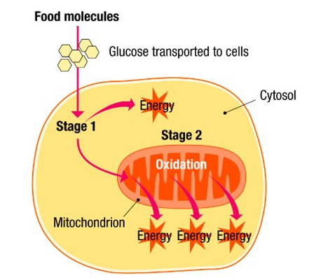
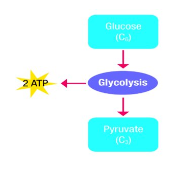
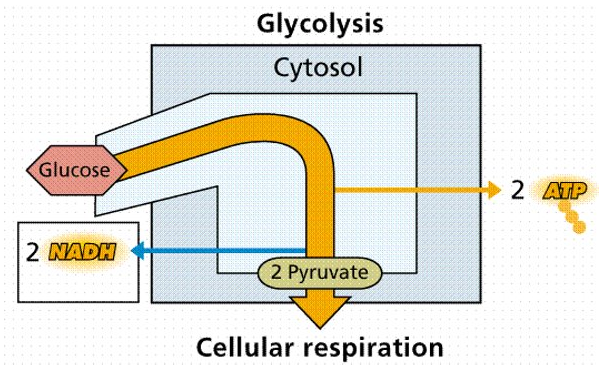
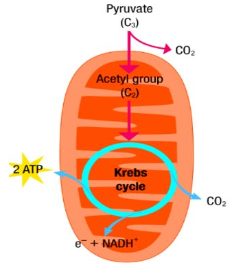
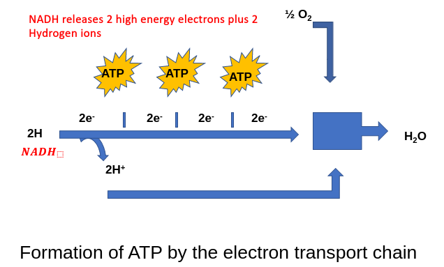
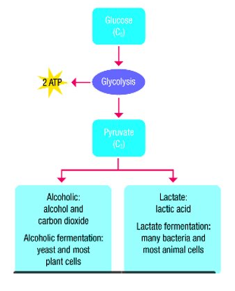
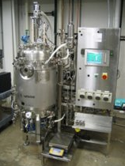

# Respiration

​Definition: Respiration is the release of energy from food​
​
- The food involved in respiration is usually glucose​
- Internal respiration is controlled by enzymes which allow energy to be released in small amounts​
- <u>The energy is trapped in molecules called ATP</u>

## Types of Respiration​
- <u>**Aerobic Respiration** – the release of energy from food in the presence of oxygen</u> Example: Humans
- <u>**Anaerobic Respiration** The release of energy from food without requiring the presence of oxygen</u> Example: Yeast

### Aerobic Respiration​
- Most living things get energy from aerobic respiration and are called <u>**AEROBES**</u>
- The <u>energy stored in bonds in glucose</u> is <u>released and used to make ATP​</u>
- <u>When ATP breaks down it supplies energy for all the reactions in a cell</u> such as movement of muscles, growth of new cells etc.
#### Equation for Aerobic Respiration​
Chemical Reaction: C6H12O6 + 6O2 -> 6CO2 + 6H2O + Energy

Word Equation: Glucose + Oxygen -> Carbon Dioxide + Water + Energy

- Aerobic respiration is <u>relatively efficient</u>, 40% of the energy in glucose is used to make ATP
- Any energy not used to produce ATP is <u>lost as heat</u>

## Energy Carriers
There are two main groups of Energy Carriers

Group 1
- a) ADP <u>**(Adenosine diphosphate)**</u> = <u>low energy molecule, found in cells of all organism</u>
- b) ATP <u>**(Adenosine triphosphate)**</u> = <u>high energy molecule, stores and transports energy</u>

Remember ATP is a source of energy for most cell reactions

<u>ATP stores energy and transfers it to where it is needed</u>

Group 2
- a) NAD (Nicotinamide Adenine Dinucleotide) = low energy
- b) NADH- = high energy molecule

### Reactions
ATP + water -> ADP + P + energy i.e. Respiration

- Phosphorylation is the addition of phosphate to a molecule (+P)
- Molecules with letter P are used in Photosynthesis

## Aerobic Respiration
Aerobic Respiration occurs in 2 stages:
- Stage 1: Glycolysis
- Stage 2: Krebs Cycle

Cytosol = Cytoplasm without the organelles

### Stage 1 - Glycolysis​

Glucose C6H12O6

Pyruvate = Pyruvic acid

- <u>Takes place in the cytosol (the cytoplasm without the organelles) as enzymes are found here</u>
- Doesn't require oxygen
- It only releases small amounts of energy
- Is the same for both aerobic and anaerobic respiration
- A <u>6 carbon carbohydrate (Glucose)</u> is converted to <u>two 3-carbon molecules</u> with the release of a <u>small amount of energy</u>
- Most of the energy in the glucose molecule remains stored in each 3-carbon molecules

### Stage 2 - Lumen and Mitochondrian

**Stage 2 has two parts:**
1. Kreb Cycle
2. Electron Transport System

#### 1. Kreb Cycle

- Protons (H+) released (2H x4)
- Energy in Acetyl Co A released (electrons)
- ADP is conerted to ATP
  
NADH & CO2 (Main products formed)

---

- In the presence of oxygen the pyruvic acid enters the **<u>lumen in the mitochondrion</u> KREBS CYCLE​**
- It loses a carbon dioxide molecule to form a 2-carbon molecule called Acetyl coenzyme A (Acetyl CoA for short)​
- Pyruvic acid also loses 2 high energy electrons that combine with NAD+ and a proton to form NADH​
- Each NADH will enter an electron transport system​

---

- The **Krebs cycle** converts the acetyl group in **CO2** and **hydrogen**
- The CO2 is released as a **waste** gas
- NADH+ is generated from **NAD+** and the **hydrogen**

#### 2. Electron Transport System

- The NADH enters and electron transport chain made up of protein molecules
- Takes place in the **<u>cristae of the mitochondria</u>**
- Oxygen is necessary​
- The foldings of the cristae increase the number of electron transport systems that can fit in them

- High energy electrons are passed from NAD+H2 to the first of these molecules​
- As electrons pass from molecule to molecule they lose some of their energy​
- Some of this energy is used to form ATP the rest is lost as heat​
- At the end of each system the low energy electron is removed by combining it with oxygen and hydrogen to form water
- The production of ATP by the electron transport system is called **Oxidative Phophorylation** as it requires oxygen + phosphate

---

- The main significance of the electron transport system is that it **produces energy rich ATP​**
- **Oxygen** is essential as it accepts the low energy electron at the end of the chain​
- If oxygen is absent aerobic organisms may die as there is no oxygen to accept the low energy electron and no ATP may be formed

## Anaerobic Respiration
(also known as fermentation)

If oxygen is not present, the pyruvic acid (pyruvate) is converted into either **lactic acid** or **ethanol** and **CO2**

Lactate Fermentation Note: cheese, yoghurt production. 2. Lactic Acid - stitch after exercise

Alcoholic Fermentation Note: Sugar --yeast--> Alcohol + CO2

<u>Anaerobic Respiration = Fermentation​</u>

As only stage 1 is involved in anaerobic respiration it only occurs in the cytosol

---

- Anaerobic respiration can occur in the presence of oxygen but it does not need to use it​
- In anaerobic respiration Glycolysis occurs this means glucose is broken into two 3-carbon molecules​
- A small amount of energy is released this way

### Lactic Acid Fermentation

- This occurs in some anaerobic bacteria and fungi and in animal muscles when there is not enough oxygen​
- In this fermentation Lactic acid is produced
- Glucose --> 2 Lactic Acid + small amount of energy
pyruvate
- **Biotechnology** refers to the use of living things (such as microorganisms and enzymes) to carry our useful reactions
- In industrial fermentation the microorganisms are placed in a container with a suitable substrate on which they can react
- The vessel in which biological reactions can take place is called a **Bioreactor**

**Advantages of Immobilised Cells​**

- Immobilisation is gentle it does not damage cells​
- Immobilised cells can be easily recovered​
- Immobilised cells reduce the need for filtration at the end of bioprocessing​
- Immobilised cells can be reused reducing costs

## Differences between Aerobic and Anaerobic Respiration​

| | Aerobic | Anaerobic |
|-|-|-|
| Location | Cytoplasm and  Lumen and Cristae of mitochondria | Cytoplasm |
| Oxygen Requirements | Use O2 | Doesn't use O2 |
| End Products | CO2 + H2O | Ethanol + CO2 or Lactic Acid |
| Energy Produced | Lots of energy​ (38 ATP) | Little energy (2 ATP) |

## Syllabus Can You?....
- Definition of the term: aerobic respiration.​
- Explain the role of aerobic respiration – what does it do for organisms?​
- Express aerobic respiration by a balanced equation.​
- State the nature of respiration from syllabus – what stages are involved, where do these take place, what happens?​
- Definition of the term: anaerobic respiration.​
- Express anaerobic respiration by a balanced equation.​
- State the nature and role of fermentation.​
- State the cellular location of the first & second stage.​
- Explain the role of microorganisms in fermentation.​
- Explain the role of microorganisms including bioprocessing and Bioreactors