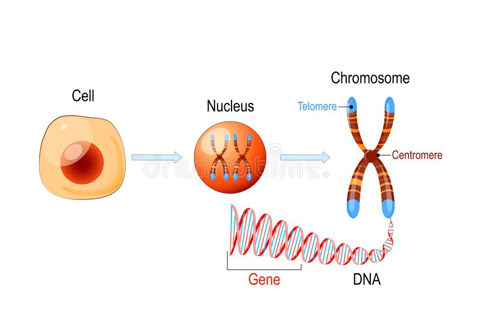

# The Cell

The smallest unit of living matter

## Animal & Plant Cells - Basic Structure

### Animal Cells

- Cell Membrane
- Cytoplasm
- Nucleus
- Mitochondria

Only the cell membrane, the cytoplasm and the nucleus can be seen under the light microscope

### Plant Cells

- Cell Membrane
- Cytoplasm
- Nucleus
- Cell Wall
- Chloroplast
- Large Vacuole
- Mitochondria

## Cell Ultra-structure

The fine details of a cell's structure can only be seen using an electron microscope

Cytoplasm is the watery liquid inside the cell membrane

Organelles are small structures found in the cytoplasm

### Animal Cell

### Animal Cell Ultra-Structure

### Plant Cell

### Plant Cell Ultra-Structure

Cells → Tissues → Organ → Organ system → Organism

## Microscopes

Cells are very small and can only be seen using a microscope

A microscope magnifies objects

A light microscope shines a beam of light through the specimen and magnifying lenses

An electron microscope uses a beam of electrons and obtains a much higher level of magnification

## Organelles

Cells contain a variety of internal structures called **organelles**

An organelle is a cell component that **performs functions for the cell**

### Cell Membrane

Cell Membranes are made up of **phospholipids** and **proteins**

The phospholipids and proteins are in constant motion

Membranes are said to be fluid

#### Functions of Cell Membranes

- Separate the cell organelles and cytoplasm from the outside
- Semi permeable - allows some molecules freely into and out and others to enter
- Membranes give some support to the cell
- Membranes recognise molecules that touch them

---

### Nucleus (Often known, as the brain of the cell)

A large organelle near the center of the cell is the **nucleus**

The control center of the cell is the nucleus

It contains the cell's genetic information

It controls the activities of the cell

#### Ultra Structure of The Nucleus

#### What’s in a nucleus?

The nucleus is made up of a double membrane with numerous nuclear pores

These control the movement of substances into and out of the nucleus

A nucleolus which contains RNA, DNA, and Proteins and it makes Ribosomes

Chromatin which contains DNA that is arranged into chromosomes which stores our genes

Since DNA cannot leave the nucleus, genetic information is copied into molecules of mRNA and sent out into the cytoplasm. This information is used to manufacture Protein

---

It is enclosed by a double membrane called the nuclear envelope

Openings in the nuclear envelope called nuclear pores allow for movement of substances in and out of the nucleus

Structures inside the nucleus that contain DNA and proteins are called Ribosomes

DNA = Deoxyribonucleic acid

---

### Mitochondria

Mitochondria supply energy to the cell in a process known as respiration

Cells with lots of mitochondria produce a lot of energy

The inner membranes of the mitochondria produce the energy

The more folds a mitochondrion has the more energy it produces

---

### Ribosomes

Ribosomes can be seen as red dots in this cell

Their function is to make proteins

---

### Cytoplasm

Cytoplasm is a clear jelly like fluid that fills the cell

It contains all the organelles within the cell

When the cell cytoplasm fills with water, it pushes the cell membrane against the cell wall making the cell turgid (rigid and firm). When the plant is short of water, the cells become flaccid (soft) and the plant wilts

---

### Chloroplast

The function of chloroplasts is Photosynthesis

The thylakoids contain the chlorophyll which traps the sun’s energy

---

### Cell Wall

The cell wall is rigid and gives plant cells a very defined shape.

The cell wall is composed of cellulose fibre, polysaccharides, and proteins.

The function of the cell wall is to support and strengthen the cell.

---

### Vacuoles

Vacuoles are membrane-bound sacs within the cytoplasm of a cell

Vacuoles provide structural support, as well as serving functions such as storage, waste disposal, protection and growth.

Plant cells have large vacuoles

---

### DNA

(no notes here yet)

---

## Eukaryotes and Prokaryotes

Organisms whose cell contain a nucleus and other membrane-bound organelles are called eukaryotes, e.g, plants & animal

Organisms whose cells never contain a nucleus and other membrane-bound organelles are called prokaryotes, e.g bacteria

## Tissue Culture

Tissue culture is the growth of cells in or on a sterile nutrient, artificial medium outside of the body

In vitro means outside the body

In vivo means inside the body

### Examples

1. **Growth of skin:** Skin is grown outside the body (often from stem cells) and new skin is grafted onto the wound
2. **Micropropagation:** Growth of large numbers of plants from cells of a parent plant. It's an inexpensive way to produce large numbers of similar plants

## Tissues

A tissue is a group of similar cells that carry out a particular function

### Plant Tissues

#### Dermal Tissue

A simple layer of **strong cells** (adaptation) ****that surrounds the different parts of a plant

Epidermis: Protects the plant

#### Vascular Tissue

Transports materials around the plant via hollow tubes (adaptation)

Xylem transports water and minerals around the plant.

Phloem transports food from the leaves to the other parts of the plant

### Animal Tissues

- Muscle tissue can contract (adaptation)
- Nervous tissue composed of nerve cells called neurons (adaptation)

#### Organ

A structure made up of tissues that work together to carry out a specific function

Examples:

- Plant Organ: Leaf
- Animal Organ: Heart

#### Organ System

A number of organs working together to carry out one or more functions

Example:

1. Circularly System
2. Digestive System

## Section Recap Videos

[Playlist of Cells and Enzymes](https://www.youtube.com/playlist?list=PLgPhtu6xzA1eNoNDWWk6fCqvj8jukNam_)

[Playlist of Cells](https://youtube.com/playlist?list=PLgPhtu6xzA1f_HDIDEIR7KEnz7PIAAU6A)