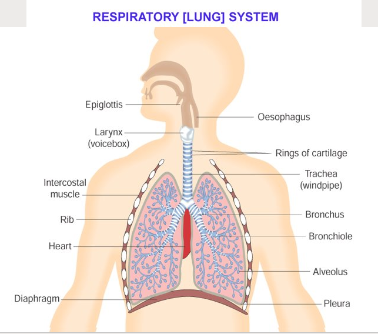
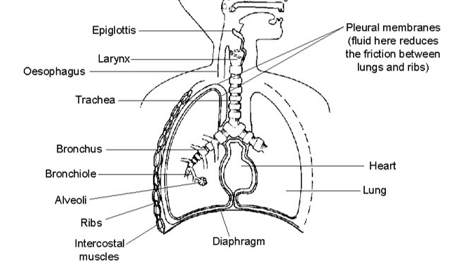
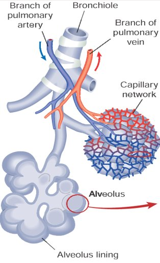
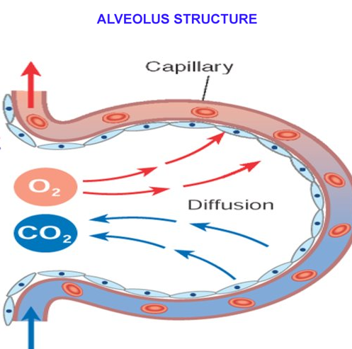
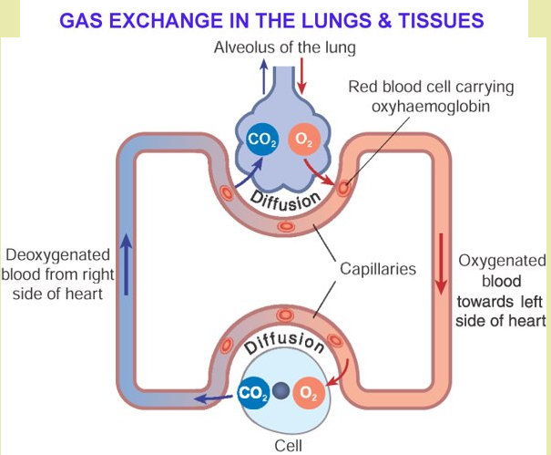
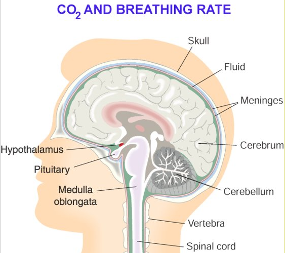
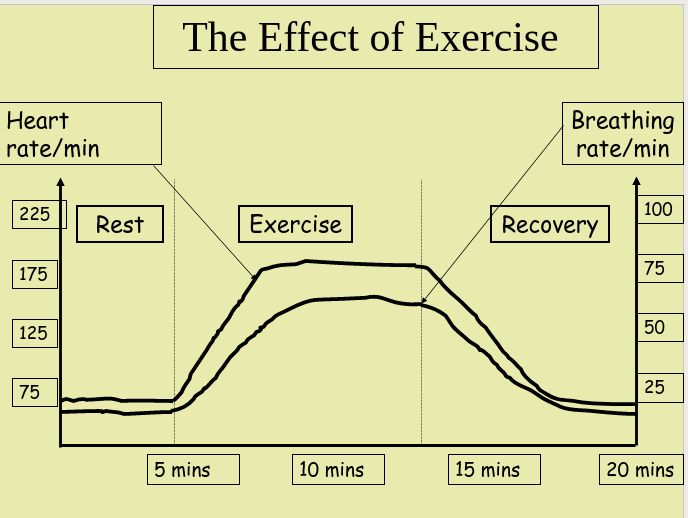
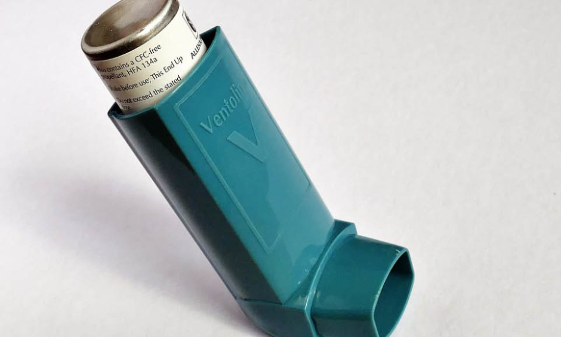
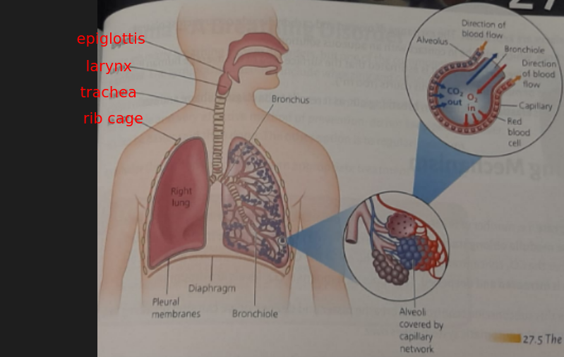

# Breathing System

## Objectives (What you will need to know from this section)

- Outline the macrostructure & function of the breathing tract in humans
- Outline the essential features of the alveoli & capillaries (as surface) for gas exchange
- Describe the mechanism of the breathing system in gas exchange
- Outline a breathing disorder: cause, prevention, treatment (Asthma/Bronchitis)

Respiration: We get our energy for metabolism by burning food in our cells (Chemical reaction)

- Humans need oxygen to carry out respiration (Aerobic respiration)

Breathing: We get fresh supplies of oxygen by breathing it in through our lungs (Physical process)

## Respiratory (Lung) System

Important Diagram - Need to Know

| Singular Word | Plural Word |
|-|-|
| Bronchus | Bronchi |
| Alveolus | Alveoli |

Your lungs are enclosed (along with the heart) between the ribs and the diaphragm (the thorax)

The ribs form a protective cage of twelve pairs of bones

<u>Intercostal muscles</u> = attached between the ribs, move the rib cage up or down

<u>The diaphragm</u> is a sheet of muscle at the base of the rib cage

**Diffusion** is the movement of molecules from a region of high concentration to a region of lower concentration

### Protection

1. The lining cells of the nose, trachea and bronchi produce a sticky mucus that traps dust and germs
2. White blood cells in the alveoli can engulf bacteria and foreign matter

### Adaptions of the Lungs for Gas Exchange

- Alveoli have a large surface area [90m²]
- Short distance between air and blood
- Complete involvement of air and blood
- Walls of alveoli are elastic

### Composition of Air in the Lungs

| Name           | Inhaled Air (% Volume) | Exhaled Air (% Volume) |
|----------------|------------------------|------------------------|
| Oxygen         | 21                     | 16                     |
| Carbon Dioxide | 0.04                   | 4                      |
| Nitrogen       | 79                     | 79                     |
| Water Vapour   | Varies                 | Saturated              |

<u>Inhaling means breathing in</u>

![Inhaling [Inspiration]](breathing-system/7.png)

1. The brain sends signals to the rib muscles and diaphragm to contract (breathing is involuntary)
2. The ribs are pulled up and out, and the diaphragm flattens downwards
3. The volume of the chest increases, so air pressure drops and more air is drawn into the lungs and alveoli

<u>Exhaling means breathing out</u>

![Exhaling [Expiration]](breathing-system/8.png)

Exhaling is a process that doesn’t require energy

1. The rib muscles and diaphragm relax, springing back to their original positions
2. Air pressure in the lungs increases, and air is pushed out from alveoli

### Gas Exchange in the Lungs & Tissues

---

Our voice box (larynx), is made of two sheets of muscle that vibrate as the air passes between them and so we can produce sounds and speech, in co-operation with our tongue, mouth and teeth

**Control of Breathing**

We breathe automatically by <u>involuntary reflex action. It is controlled by madulla oblongata of the brain</u>

<u>The rate of breathing is continually adjusted to meet the body’s needs (an example of homeostasis)</u>

## Role of the Brain in Breathing

- Mostly breathing rhythm is unconsciously set by the brain​
- We can voluntarily change the rate at which we breath​
- You can’t hold your breath forever​
- Your brain won’t let you

---

## Asthma

Asthma is a narrowing of the bronchioles due to some irritant and so the sufferer finds it difficult to inhale enough oxygen

### Symptoms

- Coughing​
- Wheezing​
- Breathlessness​
- Chest tightness

### Causes

- Pollen​
- Animals​
- Smoke​
- Dust mites​
- Chemicals​
- Exercise​

### Prevention and Treatment

- Identify triggers
  - Avoid or remove

- Use specific drug treatments
  - Bronchodilators
  - Steroids

---

