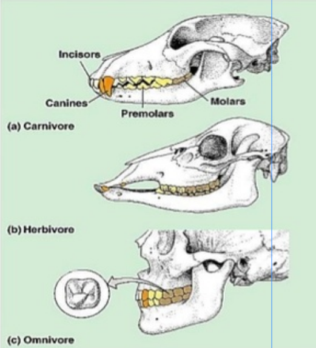
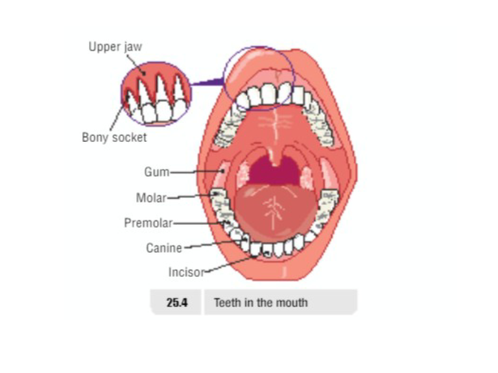

# Digestive System

## Terms

| Term | Definitions | Examples |
|---|---|---|
| Autotrophs (Producers) | An organism that makes their own food | Plants |
| Heterotrophs | An organism that cannot make their own food and must obtain food from other organisms | Humans |
| Carnivores | Animals that only eats other animals | Fox |
| Herbivores | Animals that eat only plant material | Rabbit |
| Omnivores | Animals that eat both plant and animal material | Humans are omnivores as we have teeth suitable for eating both plant and animal based foods |

## Teeth

### Carnivore

- Sharp ripping teeth
- "canines"

### Herbivore

- Wide grinding teeth
- Molars

### Omnivore

- Both kinds of teeth

## 5 Stages (of Digestion)

| Stage | Term | Definition |
|---|---|---|
| 1 | Ingestion | Taking in of food into the body |
| 2 | Digestion | Breaking food down small enough to fit through walls of intestine |
| 3 | Absorption | Taking broken down food into the blood |
| 4 | Assimilation | Using the materials absorbed |
| 5 | Egestion | Removal of undigested waste from the body (feces) |

## Ingestion

- Food enters the digestive system through the mouth which contains salivary glands
- Digestion starts in the mouth
- Physical/mechanical digestion by teeth
- Chemical digestion by enzymes

## Teeth

| Tooth Type | Function |
|---|---|
| Premolar | chewing/grinding |
| Molar | chewing/grinding |
| Canine | ripping/tearing |
| Incisor | biting |

## Dental Formula

The Dental Formula is the number of types of teeth on top and bottom of mouth of one side of the mouth

$$
I\frac{2}{2}:C\frac{1}{1}:P\frac{2}{2}:M
\frac{3}{3}
$$

## Chemical Digestion in Mouth

- A Gland is an organ that releases liquid
- Three salivary glands surround the mouth and moistens the food
- Saliva is secreted into the mouth
- Saliva contains the enzyme-salivary amylase which breaks down carbohydrate into the sugar maltose
- Amylase works best at pH 7-8

- Carbohydrate —Salivary Amylase→ Maltose

## Oesophagus

- A bolus of food forms in the back of the mouth
- While the bolus is swallowed a flap (epiglottis) covers the windpipe (trachea)
- Peristalsis = muscular contractions - push the food down the oesophagus to the stomach

## Stomach

- A muscular sac which churns (mechanical digestion) the food and mixes it with the gastric juices (hydrochloric acid). Has pH between 1-2

**The hydrochloric acid:**

- Kills bacteria entering stomach
- Converts the inactive enzyme pepsinogen into the active enzyme pepsin
- Pepsin breaks down protein into peptides

    Protein —pepsin→peptides

    Substrate: Protein

    Enzyme: Pepsin

    Product: Peptides

Stomach produces **mucous** which protects the lining of stomach being attacked by acid and enzymes

After churning a soup like liquid called **chyme** is formed which enters the small intestine

## Small Intestine

- Duodenum and ileum
- Long, narrow tube
- Digestion continues in first part of small intestine
- Absorption occurs in rest of small intestine
- Inner lining is folded and covered in small projections called villi
- Surrounded by a network of blood capillaries

### Absorption in the small intestine

Glucose and amino acids are absorbed directly from villi into the blood capillaries and are transported to the liver by the HEPATIC PORTAL VEIN

Fatty acids and glycerol don’t pass through villi but instead are absorbed into the lymphatic system and then enter the blood and then travel to the liver

## Pancreas

- Pancreas lies below the stomach
- The pancreas is a digestive gland **(Glands are organs that produce one or more substances)**

### It secretes 3 digestive enzymes

| Term | Definition |
|---|---|
| Amylase | Continues digestion of carbohydrate into glucose |
| Protease | Continues breakdown of proteins and polypeptides down into amino acids |
| Lipase | Breaks fats down into fatty acids & glycerol |

## Large Intestine

- The large intestine comprises the caecum and colon
- It is a wide tube
- **Functions:**
    1. Absorbs water and prepares faeces for elimination
    2. Contains symbiotic bacteria which produce Vitamins B & K
- **Symbiotic bacteria** have a **mutualistic relationship** with humans (a close association between two species where both species benefit)

## Liver

- The liver is the largest gland in the body
- Functions:
1. Stores glucose as glycogen
2. Breaks down excess amino acids into urea
3. Produces bile - which digests fat
4. Breakdown toxins like alcohol

## Bile

- Bile is produced: Liver
- Bile is stored: Gall bladder
- Bile is brought to the intestine by: bile duct
- The function of bile is to emulsify (separate) fats
- Another function of bile is to neutralise the acid coming from the stomach

## Enzyme Digestion

| Substrate (What it acts on) | Enzyme | Product (What's Produced) | Site of Production | Site of Action | pH |
|---|---|---|---|---|---|
| Starch | Amylase | Glucose | Pancreas | Small Intestine | 10 |
| Fat | Lipase | Fatty Acids, Glycerol | Pancreas | Small Intestine | 10 |
| Protein | Protease | Amino Acids | Pancreas | Small Intestine | 10 |

## Fibre

- Indigestible material
- Prevent Constipation by retaking moisture to keep feces soft
- Prevents bowel cancer by carrying toxins through large intestine more rapidly

<!--## Medical disorders of the digestive system-->

---

## Section Recap Videos

[Playlist of Digestion Videos](https://youtube.com/playlist?list=PLgPhtu6xzA1f8KQq93toswwxqF5SZ0Zhu)