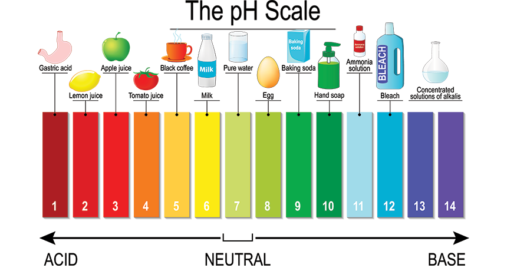

# Enzymes & Metabolism

## Metabolism

**Metabolism** is all the chemical reactions that occur within a living organism

All these reactions are controlled by enzymes

A metabolic pathway describes a series of reactions which result in a particular process e.g respiration

Metabolic reactions can be divided into anabolic and catabolic reactions

## Enzymes

An enzyme is a protein that speeds up a chemical reaction without being used up in the reaction

### Properties of Enzymes

- Made of protein
- Speed up chemical reactions
- Specific to one reaction
- Can be reused many times
- They have a specific region on their surface which is called the active site
- They work on a substrate
- They produce a product
- Sometimes they need a co-enzyme to work

### Examples of Enzymes

| Enzyme             | Definition                                             |
|--------------------|--------------------------------------------------------|
| Pancreatic Amylase | Breaks down starch into glucose                        |
| Protease           | Breaks down proteins and polypeptides into amino acids |
| Lipase             | Breaks down fats into fatty acids and glycerol         |

## Mechanism of Enzyme Action - Induced Fit Theory

The active site of an enzyme is a specific shape to fit the substrate

When the active site comes in close contact with the substrate it changes shape to closely fit the substrate

When the enzyme and substrate are joined together, it is called the 'enzyme-substrate complex'

The enzyme returns to its original shape and is then released leaving the product behind

The enzyme can now catalyse another reaction

## Factors influencing enzyme activity

1. pH
- pH is a measure of how acidic or alkaline (base that is soluble in water) a solution is
- Most enzymes work best in a narrow pH range close to neutral
- Outside this pH range the shape of the enzyme changes and it an no longer catalyse the reaction. **BECOMES DENATURED**
- Pepsin is an exception. It's optimum pH is 2 because it is active in the stomach

### Effects of pH on enzyme activity - Graph

1. Temperature
- Temperature effects enzyme activity
- Low temperatures mean less activity
- As temperature increases, activity increases until it reaches an optimum temperature
- Above the optimum temperature, activity starts to decrease
- High temperatures changes the shape of an enzyme and it becomes inactive - denaturation
- Optimum temperature for human enzymes is 37°C - normal body temperature
- Optimum temperature for plant enzymes is 20 - 25 °C

### Effects of temperature on enzyme activity - Graph

## Biotechnology (Bioprocessing)

- Biotechnology = Using living organisms or their enzymes to make useful products
- Traditional
    - Brewing - using yeast
    - Baking - using yeast
    - Cheesemaking - using bacteria or fungi
- Modern
    - Antibiotics - using bacteria or fungi
    - Insulin - using genetically modified bacteria
    - Antibodies - to make diagnostic kits

## Immobilised Enzymes

A modern technique

Useful enzymes (or a unicellular organism like yeast) are extracted

They are attached to an inanimate material (e.g. alginate) - immobilised

They are put into a column and the substrate poured on top

The product is collected at the end

### Diagram of column containing immobilised enzymes

### Advantages of Immobilisation

They can reused many times

They are easily separated from the product

They are more stable

Examples:

Converting sucrose to glucose by the enzyme invertase

Converting glucose to ethanol by yeast

## Section Recap Videos:

[https://youtu.be/qgVFkRn8f10](https://youtu.be/qgVFkRn8f10)