# Homeostasis

Definition: Homeostasis is the maintenance of a constant internal environment for our cells

- Your body and it’s individual cells need just the right conditions to perform at their best
- A cell’s delicately balanced chemical reactions work best within narrow limits of temperature, pH, solute concentration etc.

Simple aquatic organisms (like Amoeba and seaweeds) obtain their food, water and oxygen directly from the water that surrounds them

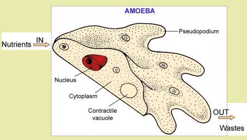

More complex organisms carry their own internal sea inside them (the tissue fluid), which is in contact with all the living cells of the body

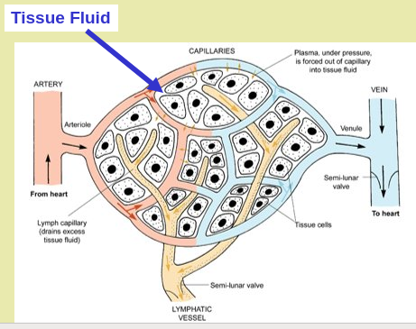

## Homeostasis

Homeostasis means “controlling internal conditions”

### Waste products need to be removed — how?

| Waste Product | How it's made and removed                                                                    |
|---------------|----------------------------------------------------------------------------------------------|
| CO2           | "Produced by respiration (release of energy from food), removed via lungs"                   |
| Urea          | "Produced by liver breaking down amino acids, removed by kidneys and transferred to bladder" |

### Internal conditions need controlling — how?

| Internal Condition             | How it's controlled                               |
|--------------------------------|---------------------------------------------------|
| Temperature                    | "Increased by shivering, decreased by sweating"   |
| Ion (salts and sugars) content | "Increased by eating, lost by sweating + urine"   |
| Water content                  | "Increased by drinking, lost by sweating + urine" |
| Blood glucose                  | Increased and decreased by hormones               |

## Why Do We Need Homeostasis

Homeostasis is necessary if an organism is to be independent of its surroundings, and if it’s metabolism is to function efficiently

Most homeostatic mechanisms work by negative feedback, i.e. if there is a change away from the normal optimum value, action is automatically taken to reverse this change

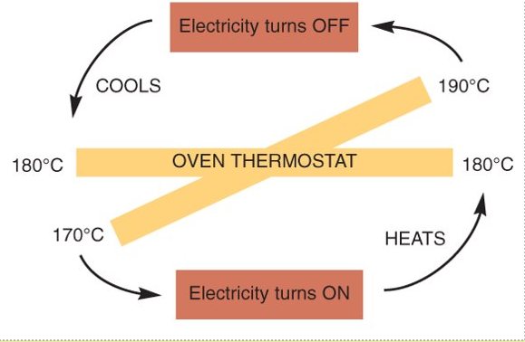

## Homeostasis - Temperature Regulation

Temperature influences the rate of enzyme-controlled reactions that sustain life

Mammals and birds are endotherms (warm blooded): they have a fairly constant body temperature

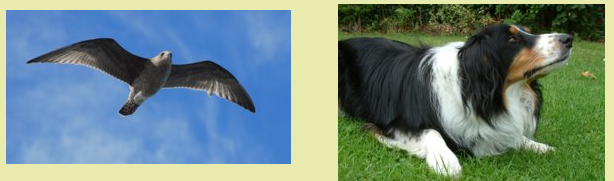

They can operate in low temperature environments, as they can keep the rate of enzyme activity high

Most animals are ectotherms (cold blooded) - their body temperature varies with the external temperature e.g. fish, amphibians, reptiles

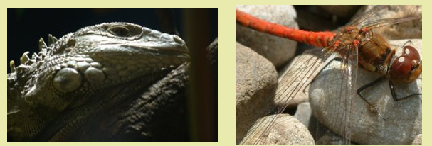

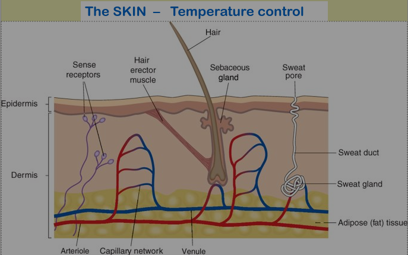

### Controlling Body Temperature

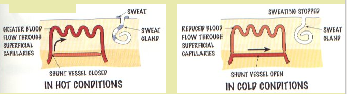

Body temperature is controlled by the thermo-regulatory centre in the brain. It is kept at 37°C as this is the best temperature for enzymes to work in. If the body becomes too hot then blood vessels dilate and sweat glands release sweat. If the body is too cold then blood vessels constrict and muscles start to shiver.

## Homeostasis - Body Temperature

- Control of body temperature is an example of how homeostasis works in humans
- Our normal core body temperature is maintained at 37°C, the heat being mainly produced from the liver during its metabolism
- Muscles, skin and blood all play a role in controlling body temperature

## Homeostasis - Water Levels in the Body

- Being a land animal, we have a continuous need to conserve water

- Water must be taken in daily and its loss must be carefully regulated

- Water is taken in as food and drink, and is also formed inside the cells during some reactions, especially respiration

**Water is lost from the body through a number of ways:**

- Lungs – some water gets evaporated as we exhale from our warm, damp lungs.

- Skin – by evaporation from cells and through sweat.

- Intestines – in the faeces (undigested food).

- Kidneys – in dissolving the poisons and wastes we wish to excrete from the body

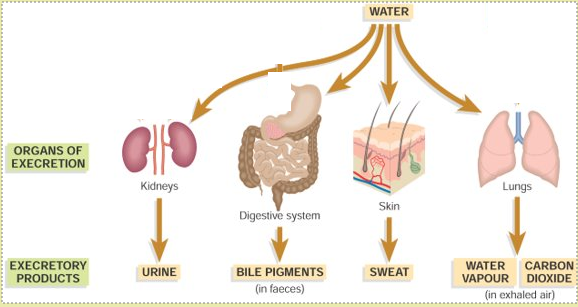

- We have no control over the amount of water lost each day from the lungs, skin or intestines
​
- So the kidneys are the water control (osmoregulatory) organs of the body – conserving or eliminating water as the body requires

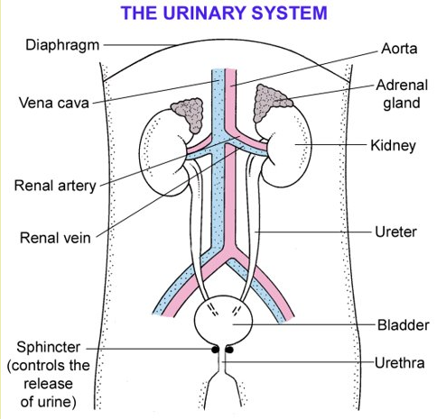

## Homeostasis - Plants

- Plants absorb water through their roots, but lose water​ from their leaves by evaporation (transpiration)​
- Over 90% of the water that enters a leaf goes right on through it and evaporates into the surrounding air.
- The evaporation of water from leaves [and stems] is called transpiration

The loss of water is reduced by a waxy cuticle and by the closing of the stomata [pores] on the lower surface of the leaf

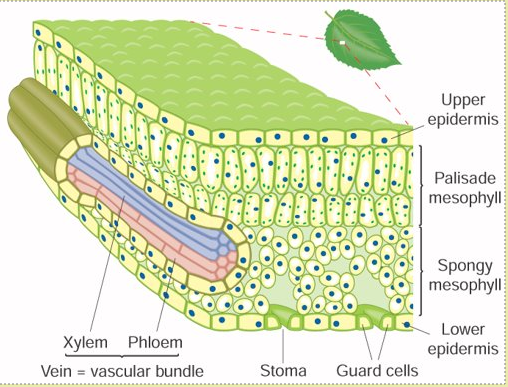

- These pores **stay open** during the day so **that CO2 can enter**, for photosynthesis. But, **water can escape** at this time too

- Stomata **can stay closed at night**, when there is no light for photosynthesis. This allows **plants to conserve water**

- The guard cells control the opening and closing

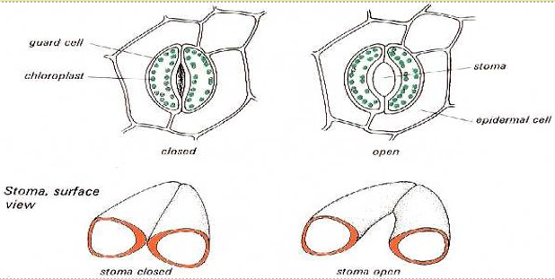