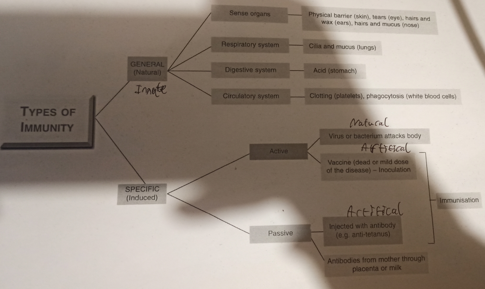

# Human Defense System (Immune System)

A pathogen is a micro-organism that cause disease

Immunity is the ability of an organism to resist infection

- Distinguish between the general and specific defense system
  - General (Innate) defence system is present and prepared to deal with pathogens before they enter the body. Example: skin, mucous membranes
  - Specific (Acquired) defense system is protection gained by detection of antigens and production of antibodies to neutralise the antigen
    - Involving specialised white blood cells, called **lymphocytes**

Friendly bacteria produces vitamins B and K

An antigen are foreign proteins that cause an immune reaction (or antibody production)

An antibody are a defence protein produced in response to an antigen

How each of the following function in the general defence system
- Skin: Provides a protective barrier against infection
- Clotting: Closes up wounds by creating a scab, which prevents infections
- Lysozyme: Natural enzymes found in tears, saliva and urine that kill bacteria
- Mucus: Traps particles which are potential pathogens
- Cilia: Push the mucus containing pathogens along tubes to get rid of them
- Acid in the stomach kills bacteria
- Beneficial bacteria: Present in large intestine in large numbers. They push out harmful bacteria

How each of the following function in the second line of general defence:
- (Monocytes) Phagocytic white blood cells: They digest bacteria
  - 
- Defense proteins complement: clear damaged cells preventing spread of infection
- Interferon: A protein that triggers Killer T-cells when infection enters body
- Inflammation: Expands vessels close to area of infection allowing white blood cells to leak into tissue fluid

(Induced) Specific defense system is protection gained by detection of antigens and production of antibodies
- 2 Types:
  1. Active Specific
  2. Passive Specific

Active immunity: When the body produces its own antibodies
- 2 Types:
  - Natural Active Immunity: When you get a disease, produce antibodies and overcome subsequent infection
    - Example: Getting Covid and then having the natural antibodies to fight reinfection
  - Artificial Active Immunity: Protection gained by the body detecting a certain antigen and producing specific antibodies to neutralise it
    - Example: Covid Vaccine

Passive immunity: Antibodies are introduced to the body
- 2 Types:
  - Natural Passive: Mother passes antibodies to her baby across placenta and in breast milk (especially in colostrum)
  - Artificial Passive: Introducing antibodies made by another animal
    - Example: Anti-tetanus injection

- 

3 Organs specific to immune system
  1. Spleen
  2. Thymus
  3. Lymph Nodes

*Vaccination* is a dead microbe *injection* into the body that *triggers antibodies*, but does *not cause disease*

*Immunisation*: Protection against a *specific pathogen* by *vaccination*

The difference between monocytes and lymphocytes in the specific immune system
- Monocytes:
  - Engulf and destroy bacteria and viruses
  - Have kidney shaped nucleus
  - 5% of white blood cells
  - Don't produce antibodies
- Lymphocytes:
  - Make antibodies + fight infection and have large nucleus
  - 25% of white blood cells

There are two types of lymphocytes
  1. B lymphocytes (B cells)
  2. T lymphocytes (T cells)

The difference between B lymphocytes and T lymphocytes in terms of where they mature
- B lymphocytes:
  - B lymphocytes mature in the *bone marrow*, before moving to the lymph nodes
  - B lymphocytes attack antigens by producing *antibodies* that surround them
- T lymphocytes:

Two types of B lymphocytes
  1. Plasma B Cells
    - Make large amount of antibodies
  2. Memory B Cells
    - Memorise the characteristics of the antigen that activated the B cells

T cells act in one of four processes:
- *Helper T cells* which recognise antigens and stimulate the production of B cells
- *Killer T cells* which attack cells containing a foreign antigen
- *Suppressor T cells* which stop immune responses
- *Memory T cells* which can memorise the immunity

<!--convert to anki beyond here-->

Describe the role of the two types of B lymphocytes:
- Plasma B cells:
- Memory B cells:

Describe the role of the four types of T lymphocytes:
- Helper T cells:
- Killer T cells:
- Suppressor T cells:
- Memory T cells:
