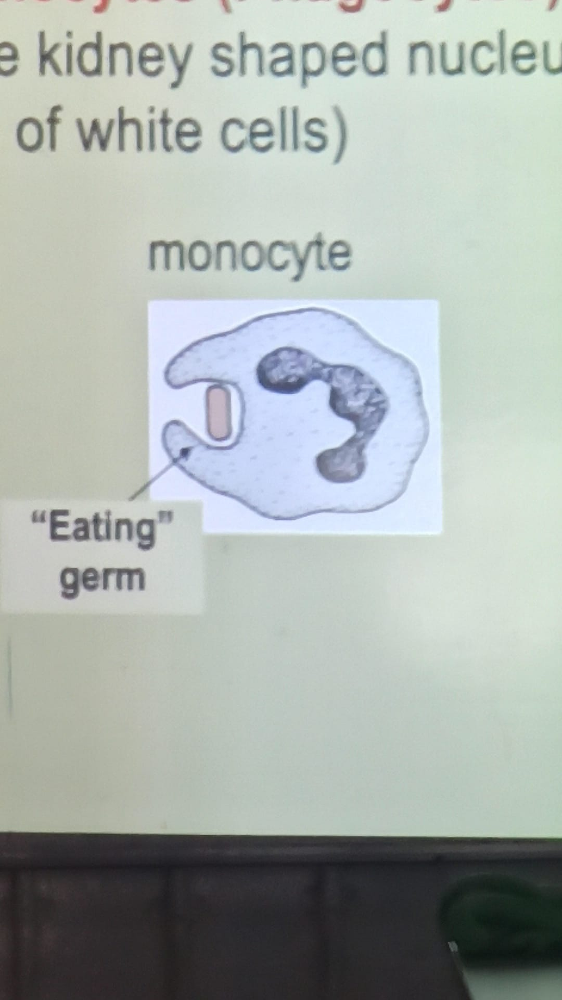

# Human Defense System (Immune System)

A pathogen is a micro-organism that cause disease

Immunity is the ability of an organism to resist infection

- Distinguish between the general and specific defense system
  - General (Innate) defence system is present and prepared to deal with pathogens before they enter the body. Example: skin, mucous membranes
  - Specific (Acquired) defense system is protection gained by detection of antigens and production of antibodies to neutralise the antigen
    - Involving specialised white blood cells, called **lymphocytes**

Friendly bacteria produces vitamins B and K

An antigen are foreign proteins that cause an immune reaction (or antibody production)

An antibody are a defence protein produced in response to an antigen

How each of the following function in the general defence system
- Skin: Provides a protective barrier against infection
- Clotting: Closes up wounds by creating a scab, which prevents infections
- Lysozyme: Natural enzymes found in tears, saliva and urine that kill bacteria
- Mucus: Traps particles which are potential pathogens
- Cilia: Push the mucus containing pathogens along tubes to get rid of them
- Acid in the stomach kills bacteria
- Beneficial bacteria: Present in large intestine in large numbers. They push out harmful bacteria

<!--convert to anki beyond here-->

How each of the following function in the second line of general defence:
- (Monocytes) Phagocytic white blood cells: They digest bacteria
  - 
- Defense proteins complement and interferon:
- Inflammation:

Induced immunity is 

Distinguish between active immunity and passive immunity
- Active immunity (two types):
- Passive immunity (two types):

Define vaccination

Define immunisation

Distinguish between monocytes and lymphocytes in the specific immune system
- Monocytes:
- Lymphocytes:

Distinguish between B lymphocytes and T lymphocytes in terms of where they mature
- B lymphocytes:
- T lymphocytes:

Describe the role of the two types of B lymphocytes:
- Plasma B cells:
- Memory B cells:

Describe the role of the four types of T lymphocytes:
- Helper T cells:
- Killer T cells:
- Supressor T cells:
- Memory T cells:
