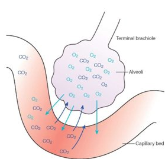
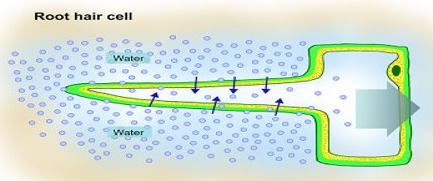
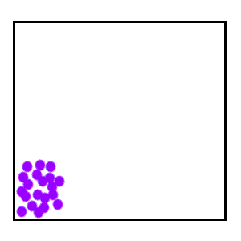
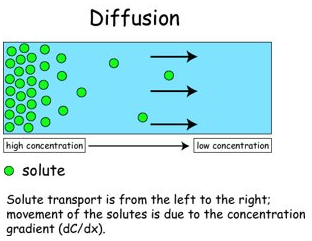
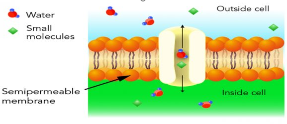
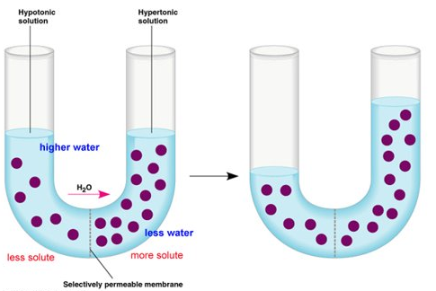
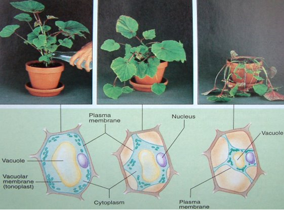
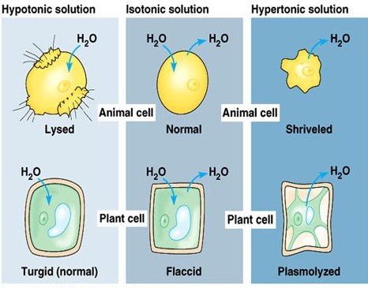
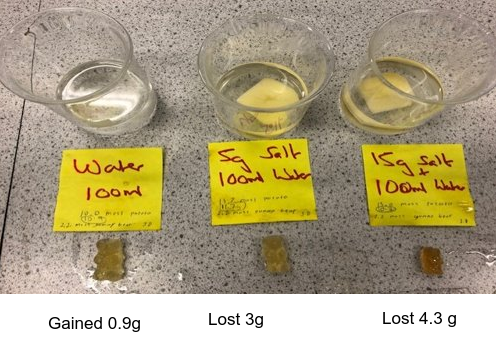
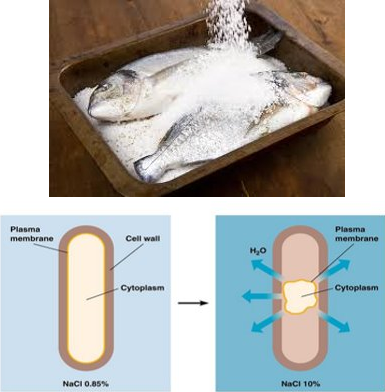

# Movement of Molecules Across Cell Membranes

## Selectively Permeable Membrane

- Phospho-lipid Bilayers
- Only allow certain substances in and out
- Occur as cell membrane & Nuclear membrane

## Three Methods

### 1. Diffusion

**Diffusion** is the movement of molecules (liquid or gas) from an area of high concentration to an area of lower concentration

Diffusion is a **passive process, requiring no energy**

Examples of Diffusion:
- Smell of perfume
- A stink bomb!!
- Oxygen diffusing from the blood into the alveoli and carbon dioxide diffusing out of alveoli into blood-

### 2. Osmosis

**Osmosis** is the movement of ***water*** from an area of high water concentration to an area of low water concentration across a ***semi-permeable membrane***

Osmosis is a **passive process and does not require energy**

Solute is a substance that dissolves in a solvent e.g. salt, sugar

#### Concentrations

| Term | Definition |
|---|---|
| Hypertonic | A solution that has a higher concentration (has less water) |
| Hypotonic | A solution that has a lower concentration (has more water) |
| Isotonic | Describes two solutions that have the same concentration |

#### Osmosis Terms

| Term | Definition |
|---|---|
| Turgid | Cell that is firm because it is full of water (cell wall allows a plant to remain turgid for long periods of time) |
| Turgor | Benefits plants by keeping them upright and standing tall |
| Flaccid | A cell that is floppy because it lacks water - plant eventually wilts |
| Lysis | Bursting of a cell due to the intake of excess water |

#### Artificial semi-premeable membranes

Visking tubing and cellophane are artifical semi-premeable membranes and can be used to demonstrate osmosis

### Food Preservation

Food spoilage is caused by bacteria

To avoid food spoilage:

- Food can be placed in a high solute concentration e.g. sugar or salt solution
- This causes the water inside the food cells and inside the bacteria to leave due to osmosis
- This dehydration means the bacteria cannot function

#### Examples of Food Preservation

### 3. Active Transport

<u>**Active Transport**</u> - The movement of <u>**molecules**</u> across a cell membrane <u>**against** the concentration gradient i.e. from low concentration to high concentration</u>

This process is active and requires energy

Cells involved in active transport have high energy requirements and contain many mitochondria

Example of Active Transport:

- Uptake of glucose in villi of small intestine