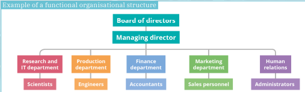
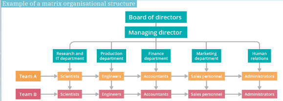
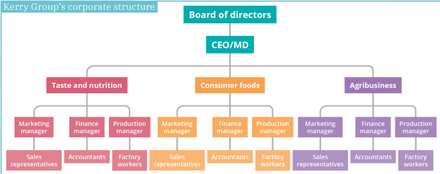
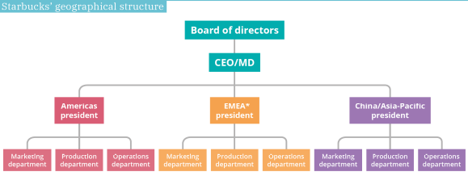

# 8. Management Activities: Planning, Organising and Controlling

## Learning Outcomes from this chapter

**On completion, you should be able to:**

- Evaluate the effectiveness of the different management activities
- Analyse how different types of planning activities contribute to business success
- Define what a SWOT analysis is and illustrate it for a business
- Outline the features, benefits and challenges of different organisational structures
- Outline the situation in which different spans of controls are appropriate
- Describe how good management control systems can achieve efficiency in business
- Explain the methods a business could consider using to minimise the risk of bad debts

## Definition of planning

**Planning** is when a business sets specific goals and objectives and then outlines strategies that allow it to achieve them

**SWOT analysis:** **s**trengths/**w**eaknesses (internal), **o**pportunities/**t**hreats (external)

| | |
|-|-|
| **S** | Resources (e.g. patent, USP, design) |
| **W** | Outside chance (e.g. new market) |
| **O** | No website |
| **T** | Negative outside (e.g. new competitor) |

<!--card-->

## Strengths
- Products
- USP
- Good reputation
- High quality

<!--card-->

## Weakness
- Production issues
- Delivery delays
- Customer feedback
- Staff issues

<!--card-->

## Opportunities
- New market
- Legislation
- New supplier

<!--card-->

## Threats
- Taxation
- New competitors
- Weather

<!--card-->

## Steps in planning

1. Analyse current situation
- Carry out a SWOT analysis
2. Set goals/objectives
- Time related
- What we hope to achieve
- How we will achieve it
3. Create a plan
- Labour (manpower) plan
- Resources planned out
- Strategic, tactical, contingency, operational
4. Create the timeline
- When does each goal/objective need to be achieved
5. Review the plan
- Check progress regularly

<!--card-->

## Types of planning

| | |
|-|-|
| Mission statement | Visionary statement containing the company values |
| Strategic planning | Created by senior management, long-term goals (from mission statement)|
| Tactical planning | Created by middle management, short-term goals (from strategic planning)|
| Operational planning | Day-to-day planning, staff rosters, etc. |
| Contingency planning | Back-up plan for an emergency or unforeseen event |

<!--card-->

### Benefits of planning

| | |
|-|-|
| Future-focused | Business can arrange resources effectively and be proactive |
| Reduces uncertainty | Plans for unforeseen events, clear objectives to follow |
| Attracts investors | Shows diligence, impresses investors, shows expected profits |
| Assesses performance | Checks objectives against actual performance; takes corrective action |

<!--card-->

## Organising

**Organising:** Arranging the resources of a business into an organised structure in order to achieve its objectives

### Important terms

| | |
|-|-|
| Chain of command | Hierarchy in business from senior management down to employees |
| Span of control | Number of subordinates who report to one manager. Wide or narrow span, depending on factors such as: skills of the manager and workers, nature of work being done, company culture |

<!--card-->

## Organisational structures – functional

**Benefits:** specialisation, clear hierarchy, clear promotional path, wider span of control

**Challenges:** isolation of departments, hard to co-ordinate, communication issues across departments

### Example of a functional organisation structure

<!--card-->

## Organisational structures – matrix

**Benefits:** unity, improved decisions, relationships, responsibility

**Challenges:** slower decisions, unclear command, conflict

### Example of a matrix organisation structure

<!--card-->

## Organisational structures – product

**Benefits:** competition, focused resources, flexibility

**Challenges:** duplication, lack of cohesion, cannibalisation

### Kerry Group’s corporate structure 

<!--card-->

## Organisational structures – geographical

**Benefits:** specialisation, clear hierarchy, clear promotional path, wider span of control

**Challenges:** isolation of departments, hard to co-ordinate, communication issues across departments

### Starbucks’ geographical structure

<!--card-->

## Controlling

**Controlling:** involves measuring any deviations away from a company’s plans and acting to correct them

<!--card-->

## The four areas of control for a business

| | |
|-|-|
| Financial control | Ensure profitability and liquidity. Plan (cash flow forecast), reduce costs (cheaper suppliers), ensure cash is available to pay short-term debts |
| Stock control | Achieve optimal stock levels (don’t under/overstock), reduce costs and obsolete goods, do regular stocktakes (check for theft), JIT |
| Quality control | Physical inspections (sampling), quality circles (staff teams), quality marks (ISO, Q Mark), improve consumer satisfaction/loyalty  |
| Credit control | Minimise bad debts, incentivise cash payments, check creditworthiness of customers, set credit limits, penalise late payments, organise invoices |
