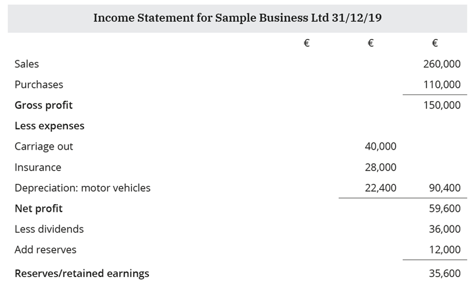
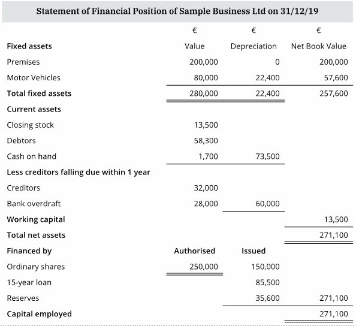
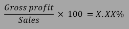
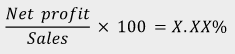
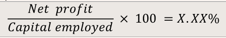

# Monitoring a Business: Ratio Analysis

## Learning Outcomes from this chapter

**On completion, you should be able to:**

- Explain the main ratios used for assessing a company's financial performance
- Illustrate the main uses of the income statement and the statement of financial position for a business
- Calculate and interpret the main profitability, liquidity and debt and equity ratios
- Recommend how to improve profitability, liquidity and debt and equity ratios
- Understand the importance of accountancy and business data in the monitoring of the business enterprise
- Identify the main limitations of ratio analysis when interpreting a company's performance

## The income Statement

| | |
|-|-|
| Gross profit | Sales - cost of sales, direct cost of manufacturing |
| Net profit | Gross profit - expenses |
| Reserves | Retained earnings, net profit - dividends + previous reserves |
| Uses | Shows level of expenses (manager), level of dividends (investors) |

<!--card-->

## The statement of financial position

| | |
|-|-|
| Fixed assets | Value of long-term assets a business uses/owns |
| Current assets | Value of short-term assets (cash, debtors, closing stock) |
| Current liabilities | Value of short-term debts (trade creditors, overdraft) |
| Working capital | Short-term finance to run the company day-to-day (current assets - current liabilities) |
| Debt capital | Long-term borrowing (bank loans > 5 years + preference shares) |
| Equity capital | Long-term borrowing (issued share capital + reserves) |
| Capital employed | All long-term funding for the business (equity capital + debt capital) |

<!--card-->

## Gross Profit Margin (GPM) – profitability ratio

| | |
|-|-|
| Explanation | Percentage of sales a business keeps after deducting cost of sales |
| Formula |  |
| How to improve | Increase sales (advertising campaign). Reduce direct costs |
| Interested stakeholders | Employees (job security). Investor (measure against competitors). Manager (assess performance, earn bonuses) |

<!--card-->

## Net Profit Margin (NPM) - profitability ratio

| | |
|-|-|
| Explanation | Percentage of sales a business keeps after deducting all expenses |
| Formula |  |
| How to improve | Increase sales (promotional campaign). Reduce expenses (change service provider) |
| Interested stakeholders | Employees (job security). Investor (measure against competitors) |

<!--card-->

## Return on Investment (ROI) – profitability ratio

| | |
|-|-|
| Explanation | Percentage of net profit from the long-term capital invested |
| Formula |  |
| How to improve | Increase net profit (reduce expenses/increase sales). Reduce long-term loans/debts |
| Interested stakeholders | Investors (shows their expected return). Employees (with shares) |

<!--card-->

## Current ratio - liquidity ratio

(Slide is blank for some reason, not sure what goes here)

## Acid test ratio – liquidity ratio

| | |
|-|-|
| Explanation | Compares value of current assets owned by the business with how much it owes in the short term. Removes closing stock from current ratio, as it can be slow to sell
| Formula | (Current assets – Closing stock): Current liabilities = X:1 (ideal = 1:1) |
| How to improve | Sell slow-moving stock at a discount |
| Interested stakeholders | Employees (shows if there is enough cash to pay staff on time). Suppliers (shows the risk of the business becoming a bad debt) |

<!--card-->

## Debt/Equity ratio – gearing ratio

| | |
|-|-|
| Explanation | Compares long-term funding of the business – % debt to % equity funding |
| Formula | Debt capital : Equity capital = X:1 |
| How to improve | <1:1 low geared; 1:1 neutral gearing; >1:1 highly geared |
| Interested stakeholders | Shareholders (high debt means high interest/repayments) |

<!--card-->

## Limitations of ratio analysis

| | |
|-|-|
| Changes to staffing | The business may have lost key personnel over the year. The business might not be as strong going into the next year, but this would not be shown in the figures |
| Valuation of assets | Assets may be under- or over-valued in order to affect ratios favourably for the business. This may not give a clear and fair representation of the current situation |
| Changes in business environment | Predicting the future based on past performance does not factor in changes to the business environment |
| Other economic variables | Ratios do not factor in changes in inflation rates. The prices at which the business buys stock could have increased. Sales revenue could have risen without the business actually selling more, if the business increased its prices |
