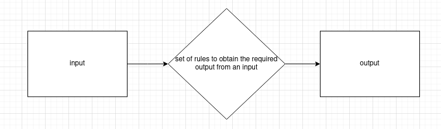

# Algorithms

An algorithm in computer science is:

- <u>Finite</u> sequence of <u>well defined (clear) instructions</u>
- Used to <u>solve a problem</u> or perform a computation
- In data processing

## What makes a good algorithm

- Finite
- Well-defined inputs
- Well-defined outputs
- Feasible
- Language independent
- Instructions are unambiguous

## Advantages of Algorithms

- Algorithm not biased
- Faster + cheaper

## Disadvantages of Algorithms

- Algorithms can be badly designed
- Removes the human component

---

## What is an algorithm?

> "A step-by-step procedure for solving a problem or accomplishing some end especially by a computer" - Merriam-Webster

Because of their speed and reliability computers are an ideal tool for running algorithms

Algorithms are:
- a sequence of instructions
- a way of capturing intelligence
- general solutions to problems
- expressed in a variety of different ways
- characterised by input, processing and output
