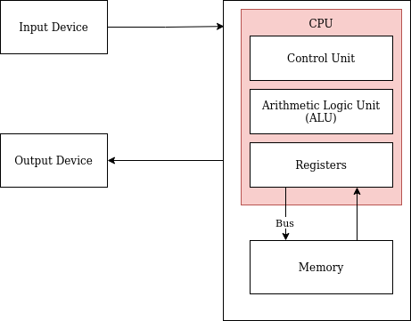

# Von Newmann Architecture

| | |
|-|-|
| Input Device | Device to tallow user to communicate with CPU e.g. keyboard, mouse, voice activated |
| CPU (Central Processing Unit) | Executes instructions |
| ALU (Arithmetic Logic Unit) | Receive data and instructions and performs operations as per the instructions |
| Registers | Short-term, temporary storage. Readily available to the CPU. Connects CPU to RAM |
| Output Device | It allows the CPU to communicate with the user. e.g. Monitor, speakers, LEDs |
