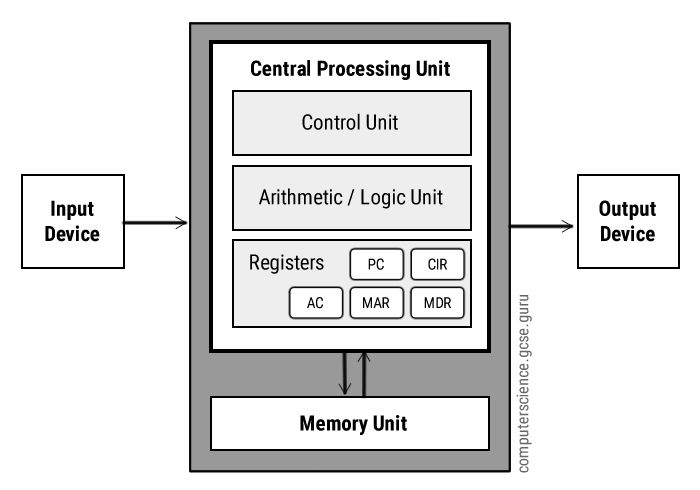
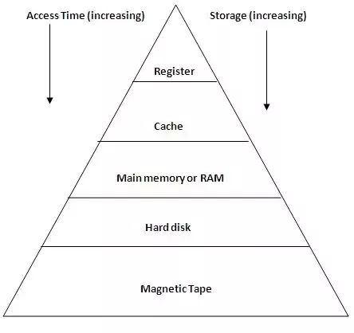
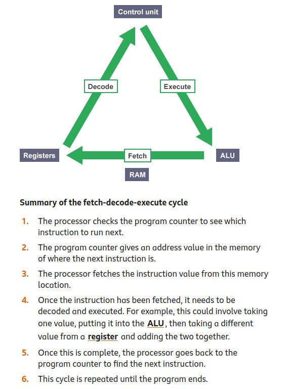

# The Central Processing Unit (CPU)

<iframe width="560" height="315" src="https://www.youtube.com/embed/FZGugFqdr60" title="YouTube video player" frameborder="0" allow="accelerometer; autoplay; clipboard-write; encrypted-media; gyroscope; picture-in-picture" allowfullscreen></iframe>

## Internals
- Arithmetic Logic Unit (ALU)
- Control Unit (CU)
- Registers
- Cache Memory
- The Fetch-Execute Cycle 

<!--card-->

<!--card-->

### Arithmetic Logic Unit

An arithmetic logic unit (ALU) is a **digital circuit used to perform arithmetic and logic operations**. It represents the fundamental building block of the central processing unit (CPU) of a computer. Modern CPUs contain very powerful and complex ALUs. In addition to ALUs, modern CPUs contain a control unit (CU)

Most of the operations of a CPU are performed by one or more ALUs, which **load data from input registers**. A register is a small amount of storage available as part of a CPU. The control unit tells the ALU what operation to perform on that data and the ALU stores the result in an output register. The control unit moves the data between these registers, the ALU, and memory

<!--card-->

### Control Unit

A control unit **coordinates how data moves around a cpu**. The control unit (CU) is a component of a computer's central processing unit (CPU) that directs operation of the processor. **It tells the computer's memory, arithmetic/logic unit and input and output devices how to respond to a program's instructions**

- **The control unit obtains data / instructions from memory**
- **Interprets / decodes the instructions into commands / signals**
- **Controls transfer of instructions and data in the CPU**
- **Coordinates the parts of the CPU**

<!--card-->

### Registers

In computer architecture, a processor register is a quickly accessible location available to a digital processor's central processing unit (CPU). Registers usually consist of a small amount of fast storage

Almost all computers load data from a larger memory into registers where it is used for arithmetic operations and is manipulated or tested by machine instructions. Manipulated data is then often stored back to main memory

Processor registers are normally at the top of the memory hierarchy, and provide the fastest
way to access data. The term normally refers only to the group of registers that are directly
encoded as part of an instruction, as defined by the instruction set

| | | |
|-|-|-|
| MAR | Memory Address Register | Holds the memory location of data that needs to be accessed |
| MDR | Memory Data Register | Holds data that is being transferred to or from memory |
| AC | Accumulator | Where intermediate arithmetic and logic results are stored |
| PC | Program Counter | Contains the address of the next instruction to be executed |
| CIR | Current Instruction Register | Contains the current instruction during processing |

<!--card-->

### Cache Memory

Cache memory is a chip-based computer component that makes **retrieving data from the computer's memory more efficient**. It acts as a **temporary storage area that the computer's processor can retrieve data from easily**. This temporary storage area, known as a cache, is more readily available to the processor than the computer's main memory source, RAM

Cache memory is sometimes called CPU (central processing unit) memory because it is typically integrated directly into the CPU chip or placed on a separate chip that has a separate bus* interconnect with the CPU. Therefore, it is more accessible to the processor, and able to increase efficiency, because it's physically close to the processor

In order to be close to the processor, cache memory needs to be much smaller than main memory. Consequently, it has less storage space. It is also more expensive than main memory, as it is a more complex chip that yields higher performance

**What it sacrifices in size and price, it makes up for in speed. Cache memory operates between 10 to 100 times faster than RAM**, requiring only a few nanoseconds to respond to a CPU request

* = In computer architecture, a bus is a communication system that transfers data between components inside a computer, or between computers. This expression covers all related hardware components (wire, optical fiber, etc.) and software

<!--card-->

<!--card-->

### Fetch-Execute Cycle

The main job of the CPU is to execute programs using the fetch-decode-execute cycle (also known as the instruction cycle or fetch-execute cycle). This cycle begins as soon as you turn on a computer

o execute a program, **the program code is copied from secondary storage into the main memory. The CPU's program counter is set to the memory location where the first instruction in the program has been stored, and execution begins. The program is now running**

In a program, each machine code instruction takes up a slot in the main memory. These slots (or memory locations) each have a unique memory address. **The program counter stores the address of each instruction and tells the CPU in what order they should be carried out**

When a program is being executed, the CPU performs the fetch-decode-execute cycle, which repeats over and over again until reaching the STOP instruction

<!--card-->

#### Summary of the fetch-decode-execute cycle

1. The processor checks the program counter to see which instruction to run next
2. The program counter gives an address value in the memory of where the next instruction is
3. The processor fetches the instruction value from this memory location
4. Once the instruction has been fetched, it needs to be decoded and executed. For example, this could involve taking one value, putting it into the **ALU**, then taking a different value from a **register** and adding the two together
5. Once this is complete, the processor goes back to the program counter to find the next instruction
6. This cycle is repeated until the program ends

<!--card-->

### Benchmarking

A test used to **assess the performance of a computer**. Different types of benchmark software are used for the **different kinds of application** you might want a computer to do

It is difficult to assess the performance of a CPU because a computer might excel at some tasks but not do so well at others. For example, a computer that is going to be used for gaming will require the best combination of hardware to handle intensive graphics quickly. The same computer might not perform so well if it was used to analyse vast amounts of scientific data

<!--card-->

### Cores

A CPU can contain one or more processing units. Each unit is called a **core**. **A core contains an ALU, control unit and registers**. It is common for computers to have two (dual), four (quad) or even more cores. CPUs with multiple cores have more power to run multiple programs at the same time. **However, doubling the number of cores will not simply double a computer's speed**. CPU cores have to communicate with each other through channels and this uses up some of the extra speed

<!--card-->

### Clock speed

The **clock speed** - also known as clock rate - indicates how fast the CPU can run. This is measured in **megahertz (MHz) or gigahertz (gHz)** and **corresponds with how many instruction cycles the CPU can deal with in a second**. A 2 gHz CPU performs two billion cycles a second. A faster CPU uses more energy and creates more heat

A computer will normally have a maximum clock speed set by default, but it is possible to change this speed in the computer BIOS. Some people increase a CPU clock speed to try to make their computer run faster - this is called **overclocking**

## Read More & Test Yourself

- [CPU and Memory](https://www.bbc.co.uk/bitesize/guides/zmb9mp3/revision/1)
- [CPU and Fetch-Execute Cycle](https://www.bbc.co.uk/bitesize/guides/zws8d2p/revision/1)
- [Fetch-Execute Cycle](https://www.bbc.co.uk/bitesize/guides/z2342hv/revision/5)
- [Fetch-Execute Cycle](https://www.computerscience.gcse.guru/theory/fetch-execute-cycle)
