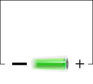

# Electronic Components

| | |
|-|-|
| Electricity | The flow of electrons |
| Voltage | Potential difference between 2 points  |
| Current | Speed and direction of the flow of electrons |
| Resistance | Control of current through a substance |

## Electricity + Computers

| Term | Explanation | Example |
|-|-|-|
| Transistor | Small electrical switch -> controls electrical flow | Logic Gates |
| Resistor | Controls the flow of electricity | dimmer switch |
| Capacitor | Store electrical energy temporarily in a potential state | light discharging |
