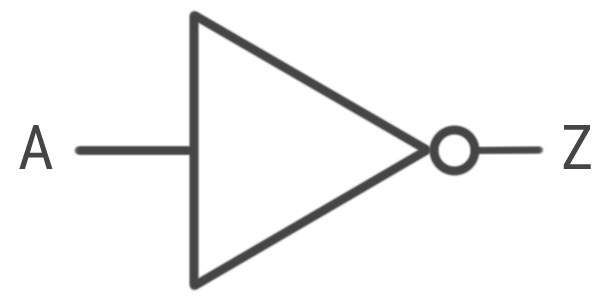

# Logic Gates

Control output from inputs

They are a series of transistors to control and output

## AND

### Truth Table

| A | B | Output |
|-|-|-|
| 1 | 1 | 1 |
| 1 | 0 | 0 |
| 0 | 1 | 0 |
| 0 | 0 | 0 |

## OR

### Truth Table

| A | B | Output |
|-|-|-|
| 1 | 1 | 1 |
| 1 | 0 | 1 |
| 0 | 1 | 1 |
| 0 | 0 | 0 |

## NOT

### Truth Table

| A | B | Output |
|-|-|-|
| 1 | 0 |
| 0 | 1 |

## NAND

### Truth Table

| A | B | Output |
|-|-|-|
| 0 | 0 | 1 |
| 0 | 1 | 1 |
| 1 | 0 | 1 |
| 1 | 1 | 0 |

## NOR

### Truth Table

| A | B | Output |
|-|-|-|
| 0 | 0 | 1 |
| 0 | 1 | 0 |
| 1 | 0 | 0 |
| 1 | 1 | 0 |