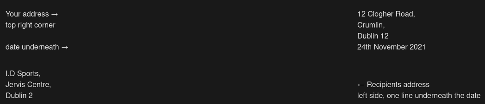

# Layout of a Formal Letter

# Convert this to steps



(skip the line)

```
Dear Sir/Madam / Mr/Ms {name}, (← salutation)
                             (start under the ,)
                             I would like to address a situation that arose when I visited your store on Tuesday 22nd November
                             {paragraph 2}
                             {paragraph 3}
                                                                                      (skip a line after the body of the letter and sign off on right hand side of the page)

                                                                                      Yours faithfully/Yours sincerely, (← sign off with either phrases) 
                                                                                        {name} (← sign off with name)
```
---

If you start the letter with Dear Sir/Madam you MUST sign off "Your sincerely". If you start with Mr or Ms {name} then you sign off "Yours faithfully".

The language used in formal letter should be formal, proper English. 

There should be at least 3 paragraphs in a formal letter.