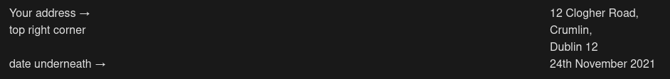

# Layout of an Informal/Personal Letter

<!--Convert this to steps-->



```
Dear {name}, (← line underneath the date)  
           (start under the , or skip the line and start at the margin)  
           We should hang out some day. We haven't seen each other in a while  
{paragraph 2}
{paragraph 3}
```
---

The language used in an informal letter is personal, slang can be used but not swear words.