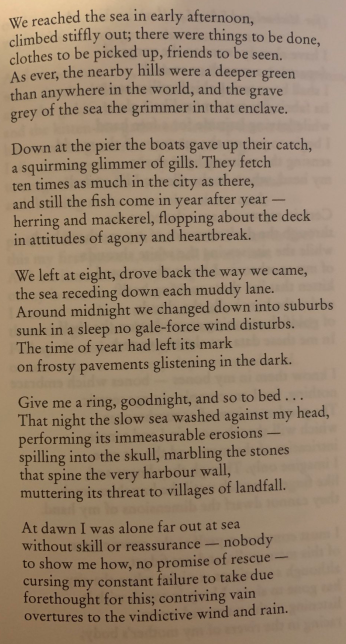

# Day Trip in Donegal by Derek Mahon

 

## Theme(s)
- Isolation
- Helplessness
- Mental health
- Political

## Poetic Techniques
- Assonance
- Alliteration
- Personification
- Sibilance
- Metaphor
- Pathetic fallacy

## Rhyme + Structure
- 5 stanzas
- 30 lines
- each stanza ends with a rhyming couplet

## Tone + Mood
- Initially starts on a hopeful note but then progressively darker/bleaker

## Imagery
- Fish flopping on the ships deck
- The spine of harbor wall
- Natural mountainous landscape 

## Symbolism
- Fish dying, like the poet is a fish out of water - alienation (Protestant in Republic)
