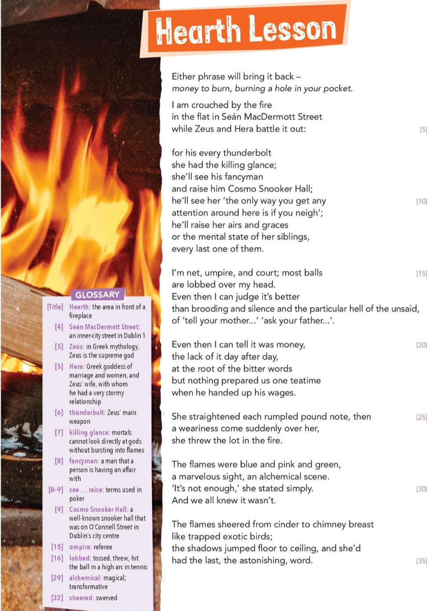

# Hearth Lesson by Paula Meehan

## Theme(s)
- Poverty
- Childhood memories
- Relationships

## Poetic Techniques
- Anaphora (the use of the same word of the start of several sentences)
- Metaphor
- Simile
- Personification
- Pun
- Allusion
- enjambment

## Rhyme Structure
- 35 lines
- 8 stanza
- written in free verse

## Tone + Mood
- Reflective
- Dramatic
- Volatile
- Menacing

## Imagery
- Child sitting by a fire in a flat
- Small child, head moving left and right as parents argue back and forth
- "Killing glance", the mother looking angrily at the father
- Money being burned in a fire and the colours the flames turn to as a result
- Exotic birds

## Symbolism
- Zeus + Hera, both Greek gods used to represent the poets parents, to children parents are like gods
- 'like trapped exotic birds', could symbolise that the child and mother are trapped in a life of poverty, unable, to achieve their goals
