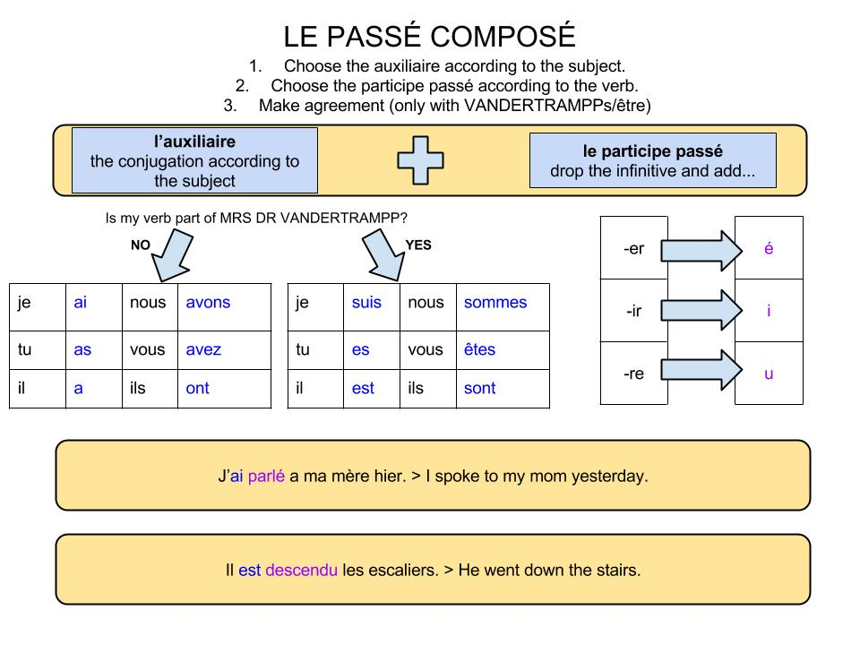

# Past Tense

## The three steps to the past tense in Français

1. The personal pronoun (je, tu, il etc.)
2. The correct part of the auxiliary verb AVOIR (to have)
3. The past participle

## The past participle

For ER Verbs:

1. Cut off the ER
2. Add é

For IR Verbs:

1. Cut of the R

For RE Verbs:

1. Cut of the RE
2. Add u

## Agreement of Participles

Only with Étre (Not for Avoir)

The participles must agree in gender and in number with the subject of the sentence

<aside>
💡 (Add example (first example: feminine, second example: plural, third example: plural and feminine) here)

</aside>

## The Verbs of Movement

The verbs of movement use Être instead of Avoir (when in the past tense)

You also use Étre instead of Avoir for reflexive verbs

### The Verbs of Movement/MRS DR VANDERTRAMPP
<!--Maybe re-arrange in MRS DR VANDERTRAMPP setup and get all verbs-->
| Français  | Anglais                  |
|-----------|--------------------------|
| aller     | to go                    |
| arriver   | to arrive                |
| descendre | to go down               |
| naître    | to be born               |
| partir    | to leave                 |
| entrer    | to enter                 |
| monter    | to go up                 |
| mourrir   | to die                   |
| sortir    | to got out               |
| rester    | to stay                  |
| tomber    | to fall                  |
| venir     | to come                  |
| retourner | to turn back (to return) |

### The Irregular Past Particles

| Verb      | Ending |
|-----------|--------|
| avoir     | eu     |
| boire     | bu     |
| connaître | connu  |
| courir    | couru  |
| craire    | cru    |
| devoir    | dû     |
| dire      | dit    |
| écrire    | écrit  |
| faire     | fait   |
| lire      | lu     |
| mettre    | mis    |
| ouvrir    | ouvert |
| pouvoir   | pu     |
| prendre   | pris   |
| recevoir  | reçu   |
| rire      | ri     |
| savoir    | su     |
| vivre     | vécu   |
| voir      | vu     |
| vouloir   | voulu  |

