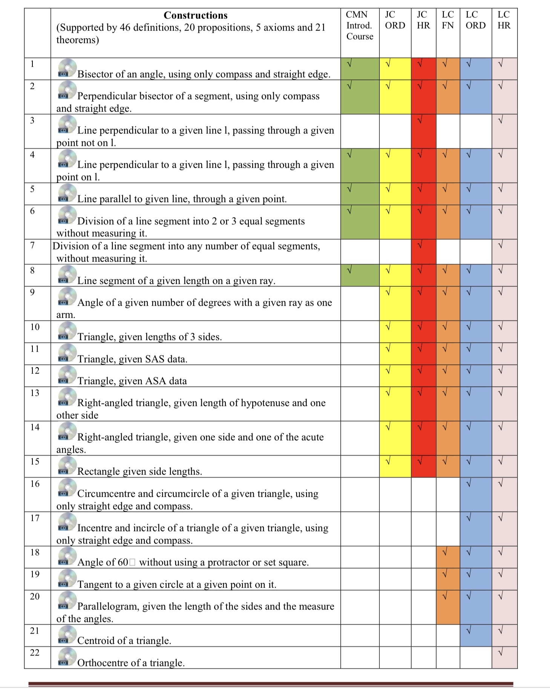

# Maths

- [Log Tables (Formulae and Tables Book)](log-tables.pdf)
- [UCD Leaving Cert Maths Videos](https://www.ucd.ie/msc/leavingcertificatevideos/)
- [Exam Technique (from themathstutor.ie)](https://themathstutor.ie/booklet)
  - [Exam Technique Booklet](https://www.themathstutor.ie/wp-content/uploads/2018/08/Maximise-Your-Maths-Grade-V8.1p.pdf)
  - Exam Technique Webinar
    - [Exam Technique Webinar Part 1](https://youtu.be/rgoTA-ISIeA)
    - [Exam Technique Webinar Part 2](https://youtu.be/4Odl21UmMdQ)
    - [Exam Technique Webinar Part 3](https://youtu.be/--5_KCLFc6Y)
    - [Exam Technique Webinar Part 4](https://youtu.be/OwsDZyNNAJc)
    - [Exam Technique Webinar Part 5a](https://youtu.be/kNGIunR7wOY)
    - [Exam Technique Webinar Part 5b](https://youtu.be/Jt2D2twlYFk)

- [Áine's Old Maths Videos for Previous Classes (Requires Teams Login)](https://web.microsoftstream.com/user/41733308-e43d-4e4f-8dca-479fef12ecb4?view=UserVideos)
  - [Áine's Old Leaving Cert Notes Videos for a Previous Class (Requires Teams Login)](https://web.microsoftstream.com/channel/4f54b6e0-ed98-45e5-8fba-6f60e735de0c)

## Paper 1

### Algebra

- [YouTube Playlist (ExamLearn)](https://www.youtube.com/playlist?list=PLIQ2_pWs9yrm7Ao7B57MMlmBZGuVm3jnL)

### Length, Area and Volume

- [YouTube Playlist (ExamLearn)](https://www.youtube.com/playlist?list=PLIQ2_pWs9yrm8SWdBZLUXpdnmyh3UuNNh) 

<!--### Real Numbers-->

### Functions

- [YouTube Playlist (ExamLearn)](https://www.youtube.com/playlist?list=PLIQ2_pWs9yrnNNIGn-_Nh4-29AodRcLHa)

<!--### Indices and Logarithms-->

<!--### Number Patterns, Sequences and Series-->

<!--### Arithmetic-->

### Financial Mathematics

- [YouTube Playlist (ExamLearn)](https://www.youtube.com/playlist?list=PLIQ2_pWs9yrlo8-l89CXQ7lEwG1fbxmYk)

### Proof by Induction

- [YouTube Playlist (ExamLearn)](https://www.youtube.com/playlist?list=PLIQ2_pWs9yrnL5WQEgJRIAAKarKwGpXg7)

### Complex Numbers

- [YouTube Playlist (ExamLearn)](https://www.youtube.com/playlist?list=PLIQ2_pWs9yrmL72NPrVxtFBpWE-Npinrx) 

### Differential Calculus

- [YouTube Playlist (ExamLearn)](https://www.youtube.com/playlist?list=PLIQ2_pWs9yrnBvnVqvqnHcRKUblWSbd5u)
- [Applications Of Differentiation Notes](applications-of-differentiation.pdf)

<!--### Integral Calculus-->

## Paper 2

<!--### Statistics-->

<!--### Probability-->

<!--### Geometry-->

### Trigonometry

- [YouTube Playlist (ExamLearn)](https://www.youtube.com/playlist?list=PLIQ2_pWs9yrlUfknGxrrCZB7XJh_zYlag)

<!--### Co-ordinate Geometry-->

<!--#### Co-ordinate Geometry: The Line-->

<!--#### Co-ordinate Geometry: The Circle-->

### Constructions

- [YouTube Playlist of All Constructions](https://www.youtube.com/playlist?list=PLNkwY0-w8e3uBJ3hoBzEYaJ21MYWF-F3S)

<!--### Enlargements-->

<!--
## Old (Don't use these)
- [Types of Functions](old/types-of-functions.md)
### Factorising
- [1: Difference of 2 Squares](old/factorising/1-difference-of-2-squares.md)
- [2: Factorising Quadratics](old/factorising/2-factorising-quadratic.md)
- [3: Removing What's Common](old/factorising/3-removing-whats-common.md)
- [4: Factorising to Simplify Fractions](old/factorising/4-factorising-to-simplify-fractions.md)
- [5: Long Division](old/factorising/5-long-division.md)
- [6: Difference of Will Be Cubic](old/factorising/6-difference-of-will-be-cubic.md)
### Simultaneous Equations
- [1: Linear Equations](old/simultaneous-equations/1-linear-equations.md)
- [2: Equations with Fractions](old/simultaneous-equations/2-equations-with-fractions.md)
- [3: Non-Linear Equations](old/simultaneous-equations/3-non-linear-equations.md)
- [4: Non-Linear Quadratic and a Line](old/simultaneous-equations/4-non-linear-quardratic-and-a-line.md)
-->

## Other Resources
- [ExamLearn (YouTube Channel)](https://www.youtube.com/channel/UCRsoWpMiCLUwVWhgRvu-1Yg/playlists)
  - [ExamLearn (Website)](https://www.examlearn.ie/)
- [Higher Level Leaving Cert Maths with Ms. Buicke (YouTube Channel)](https://www.youtube.com/channel/UC7YNPG0APHkyIqvWJI7wdRA/playlists)
- [Maths Points](http://mathspoints.ie/) - Website with Worksheets, Exam Papers and Cheat Sheets
- [TheMathsTutor.ie](https://www.themathstutor.ie/)
  - [TheMathsTutor.ie (YouTube Channel)](https://www.youtube.com/channel/UC-6NnHT6NL6IDITbe0sKbXA/playlists)
- [UCD Leaving Cert Maths Videos](https://www.ucd.ie/msc/leavingcertificatevideos/)
