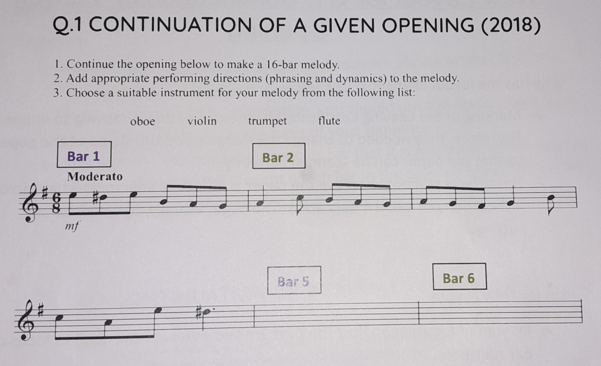
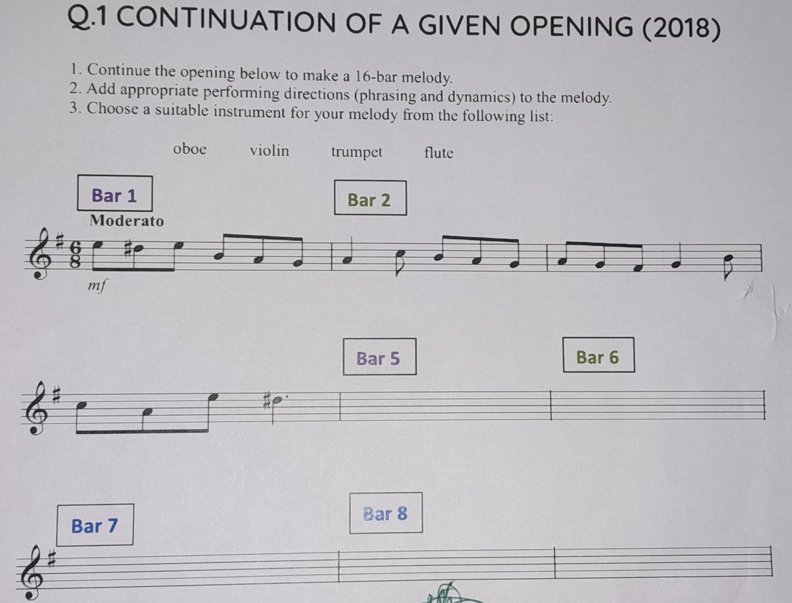

# Continuation of a Given Opening - Question 1

## Why has the layout changed?

- Marking of the Leaving Certificate Music examination is moving to online. Therefore, they needed to change the margins and the shape of the paper, so that the paper can be scanned correctly
- This affect students because the paper is now only able to fit 3 bars across rather than our usual 4 bars across the page. Visually, this may be off putting

## Plan for New Layout

- Instead of focusing on how the bars are laid out, we now need to focus on **bar numbers**
- When we being to plan our Melody question, we must focus on what bar in the opening phrase affects the bars that we must compose
- Let us look at this more closely

## Relationship Between Bars

### Variations

- Bar 1 of your melody is the first bar of your opening phrase - You will use this bar by variating it in Bar 5 and Bar 13
- Bar 2 of your melody is used to variate Bar 6 and Bar 14
- Look at the example below - This is the new layout for the 2018 Composing Paper Q1
- I have colour coded the bars, so that you can easily see where you would be using your variations

- The only difference is that you are not using the bar that is directly above the bar you are writing in. Bar 1 would usually be directly above Bar 5 and Bar 2 would usually be directly over Bar 6 - this is no longer going to happen

### Modulation

- Moving on from this you have Bar 7 and Bar 8 which needs to include your modulation
- This section of your composition does not need a relationship from the opening 4 bars - but you need to keep with the style that is presented to you. Therefore, a rhythmic or melodic idea may be taken from the opening phrase to help you do this

### Sequence

- This next part of your melody is your Sequence phrase on your B phrase. This beings at Bar 9 and ends on Bar 12
- In this section of your composition, you should use a melodic shape from the opening 4 bars to be the basis of your sequence
- This section does not have a specific bar that it is related to in the opening phrase - it is up to the student which bar in the opening phrase they want to base their Sequence section on

- Remember to end the Sequence phrase (B phrase) on an imperfect cadence (Bar 12)

### A2 Phrase - Variations and Perfect Cadence

- As mentioned in the Variation section of this document, Bar 13 will be a variation of Bar 1 and Bar 14 will be a variation of Bar 2
- Bar 15 and Bar 16 is where you use a Perfect Cadence to end your composition
- In Bar 15 and Bar 16 you might like to use rhythmic or melodic ideas from **Bar 3** and **Bar 4** if it is suitable to do so

### Overview

- Bar 1, Bar 5 and Bar 13 - Variation
- Bar 2, Bar 6 and Bar 14 - Variation
- Bar 7 and Bar 8 - Modulation
- Bar 9 to 12 - Sequence
- Bar 15 and 16 - Perfect Cadence
